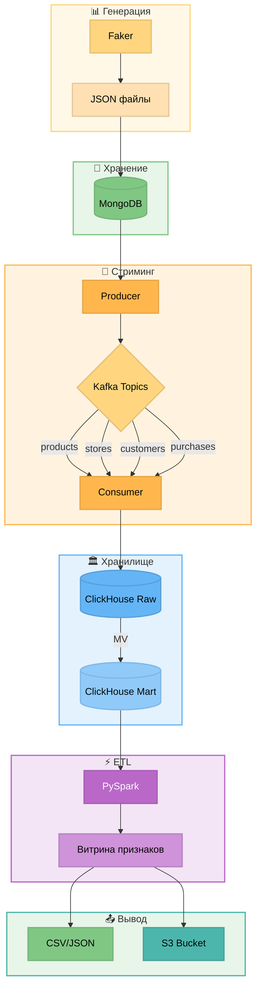
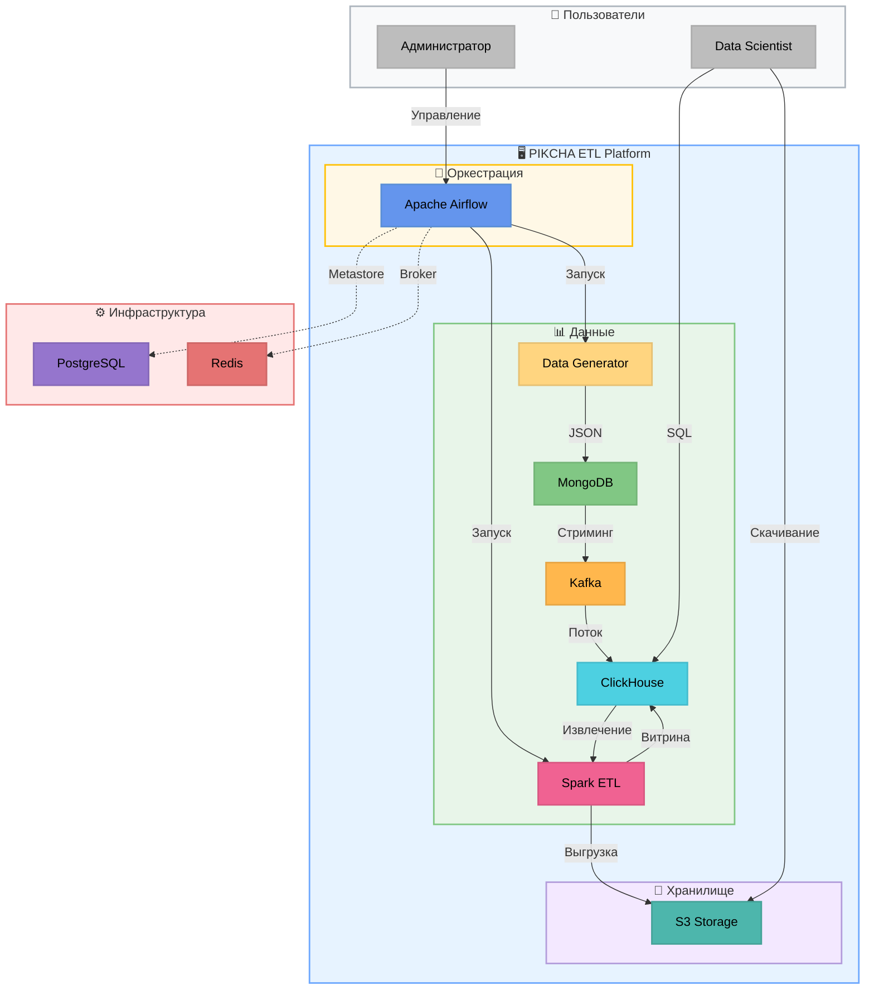
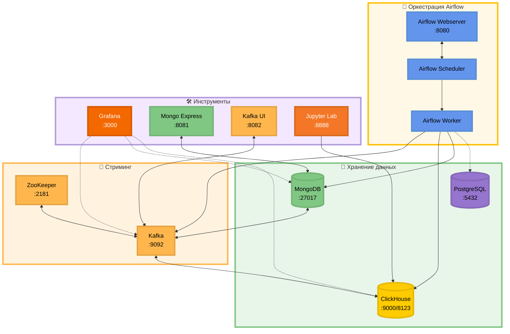
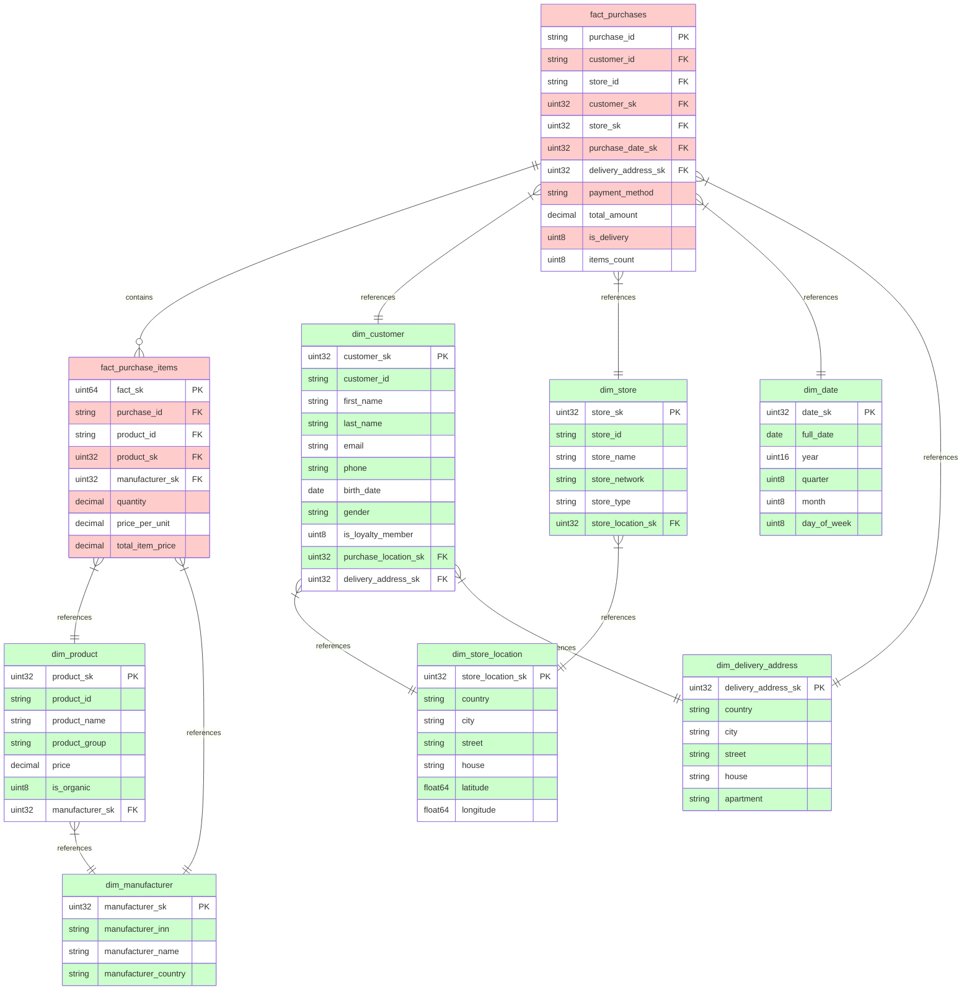

# ETL: CYBERPIKCHA_2077


> Проект представляет собой комплексное ETL-решение для аналитической обработки данных розничной сети "CYBERPIKCHA 2077". Реализована сквозная архитектура от генерации синтетических данных до построения витрин для аналитики и ML-кластеризации.


---

## 📋 Оглавление

- [Структура проекта](#-структура-проекта)
- [Технологический стек](#-технологический-стек)
- [Архитектура системы](#-архитектура-системы)
- [Структура данных](#-структура-данных)
- [Настройка конфигурации](#-настройка-конфигурации)
- [Запуск пайплайна](#-запуск-пайплайна)
- [Оркестрация с Apache Airflow](#-оркестрация-с-apache-airflow)
- [Grafana Dashboards](#-grafana-dashboards)
- [Мониторинг и отладка](#-мониторинг-и-отладка)

---

## 📁 Структура проекта

```
pikcha_test_airflow/
├── airflow_config/                # Конфигурация Apache Airflow
│   └── webserver_config.py        # Настройки веб-сервера Airflow
│
├── config/                        # Конфигурация проекта
│   ├── __init__.py                # Экспорт настроек и логирования
│   ├── logging.py                 # Централизованное логирование
│   └── settings.py                # Dataclass-конфигурация
│
├── dags/                          # DAG-файлы Apache Airflow
│   ├── etl_pipeline.py            # Главный DAG оркестрации всего пайплайна
│   ├── generate_data_dag.py       # DAG генерации синтетических данных
│   ├── load_to_mongo_dag.py       # DAG загрузки данных в MongoDB
│   ├── run_producer_dag.py        # DAG Producer (MongoDB → Kafka)
│   ├── run_consumer_dag.py        # DAG Consumer (Kafka → ClickHouse)
│   ├── run_etl_dag.py             # DAG ETL витрины признаков
│   └── run_sql_scripts_dag.py     # DAG создания таблиц в ClickHouse
│
├── src/pikcha_etl/                # Основной ETL-модуль
│   ├── __init__.py
│   ├── types.py                   # Type aliases (JSONDict, StrPath)
│   ├── generation/                # Генерация синтетических данных
│   │   └── synthetic.py           # GroceryDataGenerator
│   ├── loader/                    # Загрузчики данных
│   │   └── mongo_loader.py        # MongoDataLoader
│   ├── pipeline/                  # Kafka пайплайны
│   │   ├── mongo_kafka_producer.py      # Producer: MongoDB → Kafka
│   │   └── kafka_clickhouse_consumer.py # Consumer: Kafka → ClickHouse
│   ├── etl/                       # Batch ETL процессы
│   │   ├── process.py             # CustomerFeatureETL (Spark)
│   │   ├── config.py              # ETL конфигурация
│   │   ├── features.py            # 30 признаков клиентов
│   │   └── upload_to_s3.py        # Выгрузка в S3
│   └── utils/                     # Утилиты
│       ├── helpers.py             # Нормализация телефона/email
│       └── hashing.py             # HMAC-SHA256 хеширование
│
├── scripts/                       # CLI-скрипты запуска
│   ├── generate_data.py           # Генерация данных
│   ├── load_to_mongo.py           # Загрузка в MongoDB
│   ├── run_producer.py            # Producer (MongoDB → Kafka)
│   ├── run_consumer.py            # Consumer (Kafka → ClickHouse)
│   ├── run_etl.py                 # ETL витрины признаков
│   ├── cleanup_all.py             # Полная очистка данных (data/, MongoDB, Kafka, ClickHouse)
│   ├── dedup_mart.py              # Дедупликация таблиц mart-слоя (OPTIMIZE FINAL)
│   └── clickhouse-jdbc-0.4.6.jar  # JDBC драйвер для Spark
│
├── sql/                           # SQL-скрипты ClickHouse
│   ├── 00_create_raw_tables.sql       # Raw слой
│   ├── 01_create_mart_database.sql    # Mart слой + измерения/факты
│   ├── 02_create_materialized_views.sql # MV для автоматической загрузки
│   └── 03_create_customer_features_table.sql # Витрина признаков
│
├── plugins/                       # Плагины Airflow (кастомные хуки, операторы)
├── ui/                            # UI компоненты
│   └── UI.html                    # HTML-файл интерфейса
│
├── grafana/                       # Конфигурация Grafana
│   ├── dashboards/                # JSON-файлы дашбордов
│   │   ├── customer_features_matrix.json    # Матрица признаков клиентов
│   │   ├── mart_duplicates_analysis.json    # Анализ дубликатов mart-слоя
│   │   ├── raw_duplicates_analysis.json     # Анализ дубликатов raw-слоя
│   │   ├── raw_layer_stats.json             # Статистика raw-слоя
│   │   └── stores_geo_map.json              # Гео-карта магазинов
│   ├── alerting/                  # Правила алертинга
│   │   ├── alert-rules.yml        # Правила и условия алертов
│   │   └── contact-points.yml     # Контактные точки (Telegram)
│   ├── datasources/               # Источники данных
│   │   └── clickhouse.yml         # Подключение к ClickHouse
│   └── provisioning/              # Провижининг конфигурации
│       └── dashboards.yml         # Настройка загрузки дашбордов
│
├── data/                          # Сгенерированные JSON данные
├── output/                        # Результаты ETL (CSV/JSON)
├── logs/                          # Логи выполнения
├── notebooks/                     # Jupyter ноутбуки для аналитики
├── docs/                          # Документация
│   └── architecture.md            # Подробная архитектура системы
│
├── docker-compose.yml             # Инфраструктура контейнеров
├── Dockerfile.airflow             # Dockerfile для Airflow
├── Dockerfile.jupyter             # Dockerfile для Jupyter
├── requirements.txt               # Python зависимости
├── .env.example                   # Пример конфигурации
├── .gitignore                     # Git ignore файл
└── README.md                      # Этот файл
```

---

## 🛠 Технологический стек

| Категория | Технология | Назначение |
|-----------|------------|------------|
| **Язык** | Python 3.12+ | Основная разработка |
| **Оркестрация** | Apache Airflow 2.9.2 | Оркестрация ETL-пайплайнов |
| **Базы данных** | MongoDB 6.0 | Операционное хранение JSON |
| | ClickHouse 25.7 | Аналитическое хранилище |
| | PostgreSQL 13 | Metastore для Airflow |
| **Стриминг** | Apache Kafka 7.5 | Передача данных между слоями |
| | Zookeeper 7.3.3 | Координация Kafka |
| **Обработка** | PySpark 3.5+ | Batch ETL трансформации |
| **Визуализация** | Grafana | Дашборды и мониторинг |
| **Инфраструктура** | Docker | Контейнеризация сервисов |
| **Хранилище** | S3 (Selectel/AWS) | Архивирование результатов |
| **Notebooks** | Jupyter Lab | Интерактивная аналитика |

**Основные библиотеки Python:**
- `pymongo` — работа с MongoDB
- `kafka-python`, `confluent-kafka` — Producer/Consumer Kafka
- `clickhouse-driver` — клиент ClickHouse
- `boto3` — интеграция с S3
- `faker` — генерация синтетических данных
- `python-dotenv` — управление конфигурацией
- `apache-airflow` — оркестрация пайплайнов
- `pyspark` — ETL трансформации

---

## 🏗 Архитектура системы

Подробная архитектура в файле [architecture.md](docs/architecture.md).

### Диаграмма потока данных 



### Компоненты системы 



### 🐳 Архитектура Docker



**Описание компонентов:**

| Компонент | Порт | Назначение |
|-----------|------|------------|
| **airflow-webserver** | 8080 | Веб-интерфейс Apache Airflow |
| **airflow-scheduler** | — | Планировщик DAG-ов |
| **airflow-worker** | — | Выполнение задач (Celery) |
| **airflow-triggerer** | — | Асинхронные триггеры |
| **mongo** | 27017 | MongoDB для операционных данных |
| **clickhouse** | 9000/8123 | ClickHouse для аналитики |
| **postgres** | 5432 | Metastore для Airflow |
| **zookeeper** | 2181 | Координация Kafka |
| **kafka** | 9092/29092 | Брокер сообщений |
| **grafana** | 3000 | Визуализация и мониторинг |
| **mongo-express** | 8081 | Веб-UI для MongoDB |
| **kafka-ui** | 8082 | Веб-UI для Kafka |
| **jupyter** | 8888 | Jupyter Lab для аналитики |

---

## 🗄 Структура данных

### Raw слой (сырые данные)

| Таблица | Источник | Описание |
|---------|----------|----------|
| `raw.stores` | Kafka `stores` | Магазины с локацией и менеджерами |
| `raw.products` | Kafka `products` | Товары с КБЖУ и производителями |
| `raw.customers` | Kafka `customers` | Клиенты с предпочтениями |
| `raw.purchases` | Kafka `purchases` | Покупки с Nested-позициями товаров |

**Движок:** `MergeTree()`
**Партиционирование:** по месяцам
**TTL:** 180 дней

---

### Mart слой (витрины данных)

#### Схема данных



#### Измерения (Dimensions)

| Таблица | Ключ | Атрибуты |
|---------|------|----------|
| `dim_manufacturer` | `manufacturer_sk` | ИНН, название, страна, сайт |
| `dim_store_location` | `store_location_sk` | Страна, город, улица, координаты |
| `dim_delivery_address` | `delivery_address_sk` | Страна, город, улица, квартира |
| `dim_product` | `product_sk` | Название, группа, КБЖУ, цена, organic |
| `dim_customer` | `customer_sk` | ФИО, email, телефон, лояльность, предпочтения |
| `dim_store` | `store_sk` | Название, сеть, тип, часы работы, флаги |
| `dim_date` | `date_sk` | Дата, год, квартал, месяц, неделя, день |

#### Факты (Fact Tables)

| Таблица | Ключ | Метрики |
|---------|------|---------|
| `fact_purchases` | `purchase_id` | `total_amount`, `items_count`, `is_delivery` |
| `fact_purchase_items` | `fact_sk` | `quantity`, `price_per_unit`, `total_item_price` |

---

### Витрина признаков клиентов

Таблица `mart.customer_features_mart` содержит **30 бинарных признаков** для ML-кластеризации:

| Категория | Признак | Описание |
|-----------|---------|----------|
| **product_preference** | `bought_milk_last_30d` | Покупал молочные продукты за 30 дней |
| | `bought_fruits_last_14d` | Покупал фрукты/ягоды за 14 дней |
| | `not_bought_veggies_14d` | Не покупал овощи/зелень за 14 дня |
| | `organic_preference` | Купил органический продукт |
| | `buys_bakery` | Покупал хлеб/выпечку |
| | `bought_meat_last_week` | Покупал мясо/рыбу/яйца за 7 дней |
| | `fruit_lover` | ≥3 покупок фруктов за 30 дней |
| | `vegetarian_profile` | Нет мясных продуктов за 90 дней |
| **purchase_behavior** | `recurrent_buyer` | >2 покупок за 30 дней |
| | `inactive_14_30` | Не покупал 14-30 дней |
| | `delivery_user` | Пользовался доставкой |
| | `no_purchases` | Нет покупок (только регистрация) |
| **loyalty** | `new_customer` | Зарегистрировался <30 дней назад |
| | `loyal_customer` | Карта лояльности + ≥3 покупки |
| **spending** | `bulk_buyer` | Средняя корзина >1000₽ |
| | `low_cost_buyer` | Средняя корзина <200₽ |
| | `recent_high_spender` | >2000₽ за последние 7 дней |
| **temporal** | `night_shopper` | Покупки после 20:00 |
| | `morning_shopper` | Покупки до 10:00 |
| | `weekend_shopper` | ≥60% покупок в выходные |
| | `weekday_shopper` | ≥60% покупок в будни |
| | `early_bird` | Покупки 12:00-15:00 |
| **payment** | `prefers_cash` | ≥70% оплат наличными |
| | `prefers_card` | ≥70% оплат картой |
| **location** | `multicity_buyer` | Покупки в разных городах |
| | `store_loyal` | Один магазин |
| | `switching_store` | Разные магазины |
| **basket** | `single_item_buyer` | ≥50% покупок — 1 товар |
| | `varied_shopper` | ≥4 категорий продуктов |
| | `family_shopper` | Среднее кол-во позиций ≥4 |

**Дополнительные метрики:**
- `total_purchases` — общее количество покупок
- `total_spent` — общая сумма
- `avg_cart_amount` — средняя корзина

---

## ⚙️ Настройка конфигурации

### Переменные окружения

Скопируйте пример и настройте под вашу инфраструктуру:

```bash
cp .env.example .env
```

| Переменная | Значение по умолчанию | Описание |
|------------|----------------------|----------|
| **MongoDB** | | |
| `MONGO_URI` | `mongodb://localhost:27017` | URI подключения |
| `MONGO_DATABASE` | `mongo_db` | Имя базы данных |
| `MONGO_EXPRESS_USER` | `admin` | Логин Mongo Express |
| `MONGO_EXPRESS_PASS` | `pass` | Пароль Mongo Express |
| **ClickHouse** | | |
| `CLICKHOUSE_HOST` | `localhost` | Хост сервера |
| `CLICKHOUSE_HTTP_PORT` | `8123` | HTTP порт |
| `CLICKHOUSE_NATIVE_PORT` | `9000` | Native порт |
| `CLICKHOUSE_DATABASE` | `mart` | База витрин |
| `CLICKHOUSE_RAW_DB` | `raw` | База сырых данных |
| `CLICKHOUSE_USER` | `clickhouse` | Пользователь |
| `CLICKHOUSE_PASSWORD` | `clickhouse` | Пароль |
| **Kafka** | | |
| `KAFKA_BROKER` | `localhost:9092` | Адрес брокера |
| `KAFKA_GROUP` | `pikcha-consumer-group` | Consumer group |
| `KAFKA_CLUSTER_NAME` | `my-cluster` | Имя кластера |
| **Безопасность** | | |
| `HMAC_SECRET_KEY` | `your-secret-key-here` | Ключ HMAC для хеширования |
| **S3** | | |
| `S3_ENABLED` | `true` | Включить S3 |
| `S3_ENDPOINT` | `https://s3.ru-7.storage.selcloud.ru` | Endpoint |
| `S3_BUCKET` | `de-internship-pikcha` | Имя бакета |
| `S3_ACCESS_KEY` | — | Access key |
| `S3_SECRET_KEY` | — | Secret key |
| `S3_REGION` | `ru-7` | Регион |
| **Grafana** | | |
| `GRAFANA_ADMIN_USER` | `admin` | Логин администратора |
| `GRAFANA_ADMIN_PASSWORD` | `admin` | Пароль администратора |
| **Прочее** | | |
| `OUTPUT_DIR` | `output` | Директория результатов |
| `DATA_DIR` | `data` | Директория данных |
| `CSV_FILENAME_PREFIX` | `analytic_result` | Префикс файлов |
| `ZOOKEEPER_PORT` | `2181` | Порт Zookeeper |

---

## 🚀 Запуск пайплайна

### Шаг 0: Инициализация таблиц в ClickHouse

```bash
python scripts/init_clickhouse.py
```

**Параметры:**
- `--confirm` — подтвердить создание таблиц (требуется подтверждение)
- `--dry-run` — показать SQL-команды без выполнения
- `--raw-only` — создать только RAW-слой (raw.stores, raw.products, raw.customers, raw.purchases)
- `--mart-only` — создать только MART-слой (dim_*, fact_*, customer_features_mart)
- `--drop-existing` — удалить существующие таблицы перед созданием
- `--clickhouse-host` — хост ClickHouse (по умолчанию: localhost)
- `--clickhouse-port` — порт ClickHouse (по умолчанию: 9000)
- `--clickhouse-user` — пользователь ClickHouse (по умолчанию: clickhouse)
- `--clickhouse-password` — пароль ClickHouse (по умолчанию: clickhouse)

**Порядок выполнения:**
1. Создание базы данных `raw`
2. Создание таблиц raw-слоя (stores, products, customers, purchases)
3. Создание базы данных `mart`
4. Создание таблиц mart-слоя (dim_*, fact_*, customer_features_mart)
5. Создание Materialized Views для автоматической загрузки

📄 Лог: `logs/init_clickhouse.log`


---

### Шаг 1: Генерация синтетических данных

```bash
# Генерация по умолчанию (45 магазинов, 50 товаров, 45 покупателей, 200 покупок)
python scripts/generate_data.py

# Генерация с кастомным количеством объектов
python scripts/generate_data.py \
    --num-stores 100 \
    --num-products 200 \
    --num-customers 500 \
    --num-purchases 1000

# Краткая форма
python scripts/generate_data.py -n 1000  # 1000 покупок
```

**Параметры:**
- `--num-stores` — количество магазинов (по умолчанию: 45 = 30 + 15 по сетям)
- `--num-products` — количество товаров (по умолчанию: 50 = по 10 из категории)
- `--num-customers` — количество покупателей (по умолчанию: = количеству магазинов)
- `--num-purchases` / `-n` — количество покупок (по умолчанию: 200)
- `--output-dir` / `-o` — директория вывода (по умолчанию: `data`)

**Результат:**
```
data/
├── stores/           # 45 файлов (store-001.json ... store-045.json)
├── products/         # 50 файлов (prd-1000.json ... prd-1049.json)
├── customers/        # 45 файлов (cus-1000.json ... cus-1044.json)
└── purchases/        # 200 файлов (ord-00001.json ... ord-00200.json)
```


**Гибкая настройка через Python API:**
```python
from src.pikcha_etl.generation.synthetic import GroceryDataGenerator

generator = GroceryDataGenerator()
result = generator.run(
    num_stores=100,        # 100 магазинов
    num_products=200,      # 200 товаров
    num_customers=500,     # 500 покупателей
    num_purchases=1000     # 1000 покупок
)
print(result)  # {'stores': 100, 'products': 200, 'customers': 500, 'purchases': 1000}
```
📄 Лог: `logs/generate_data.log`

---

### Шаг 2: Загрузка данных в MongoDB

```bash
python scripts/load_to_mongo.py --data-dir data
```

**Параметры:**
- `--data-dir` — директория с данными
- `--mongo-uri` — URI MongoDB (из `.env`)
- `--database` — имя базы (из `.env`)
- `--no-clear` — не очищать коллекции перед загрузкой

📄 Лог: `logs/load_to_mongo.log`

---

### Шаг 3: Producer (MongoDB → Kafka)

```bash
python scripts/run_producer.py
```

**Параметры:**
- `--mongo-db` — имя базы MongoDB
- `--kafka-broker` — адрес брокера
- `--topics` — список топиков
- `--hmac-key` — ключ HMAC (опционально)

**Топики Kafka:**
- `products` — товары
- `stores` — магазины
- `customers` — клиенты
- `purchases` — покупки

📄 Лог: `logs/run_producer.log`

---

### Шаг 4: Consumer (Kafka → ClickHouse)

```bash
python scripts/run_consumer.py
```

**Параметры:**
- `--clickhouse-host` — хост ClickHouse
- `--clickhouse-port` — порт (по умолчанию: 9000)
- `--clickhouse-raw-db` — база сырых данных
- `--kafka-broker` / `--kafka-group` — параметры Kafka

📄 Лог: `logs/run_consumer.log`

---

### Шаг 5: ETL витрины признаков (Spark)

```bash
python scripts/run_etl.py --output-format all
```

**Параметры:**
- `--output-format` / `-f` — формат вывода:
  - `clickhouse` — только ClickHouse
  - `csv` — только CSV
  - `json` — только JSON
  - `all` — все форматы (по умолчанию)
- `--date` — дата витрины (YYYY-MM-DD)
- `--upload-s3` — загрузить в S3
- `--s3-format` — формат для S3 (`csv`, `json`, `all`)

📄 Лог: `logs/run_etl.log`

---

## 🔁 Оркестрация с Apache Airflow

Проект использует **Apache Airflow 2.9.2** для оркестрации ETL-пайплайна. Все задачи автоматизированы через DAG-и.

### DAG-файлы

| DAG | Файл | Расписание | Описание |
|-----|------|------------|----------|
| **00_run_sql_scripts** | `run_sql_scripts_dag.py` | По требованию | Создание таблиц в ClickHouse (Raw + Mart) |
| **01_generate_synthetic_data** | `generate_data_dag.py` | По требованию | Генерация синтетических данных (stores, products, customers, purchases) |
| **02_load_data_to_mongodb** | `load_to_mongo_dag.py` | По требованию | Загрузка JSON-файлов в коллекции MongoDB |
| **03_run_mongodb_kafka_producer** | `run_producer_dag.py` | По требованию | Producer: MongoDB → Kafka (4 топика) |
| **04_run_kafka_clickhouse_consumer** | `run_consumer_dag.py` | По требованию | Consumer: Kafka → ClickHouse Raw |
| **05_run_customer_feature_etl** | `run_etl_dag.py` | По требованию | ETL витрины признаков (ClickHouse + S3) |
| **etl_pipeline** | `etl_pipeline.py` | `0 10 * * *` (ежедневно в 10:00) | **Главный DAG** — оркестрация всего пайплайна |

### Главный пайплайн (etl_pipeline)

```
SQL Scripts → Generate Data → Load to MongoDB → Producer → Consumer → ETL
```

**Последовательность выполнения:**
1. `trigger_run_sql_scripts` — инициализация таблиц в ClickHouse (RAW + MART слои)
2. `trigger_generate_synthetic_data` — генерация синтетических данных
3. `trigger_load_data_to_mongodb` — загрузка JSON в MongoDB
4. `trigger_run_mongodb_kafka_producer` — стриминг данных в Kafka
5. `trigger_run_kafka_clickhouse_consumer` — загрузка данных в ClickHouse RAW
6. `trigger_run_customer_feature_etl` — расчёт витрины признаков (30 признаков)

**Альтернатива через CLI:**
```bash
# Шаг 0: Инициализация таблиц в ClickHouse
python scripts/init_clickhouse.py --confirm

# Шаг 1: Генерация данных
python scripts/generate_data.py

# Шаг 2: Загрузка в MongoDB
python scripts/load_to_mongo.py

# Шаг 3: Producer (MongoDB → Kafka)
python scripts/run_producer.py

# Шаг 4: Consumer (Kafka → ClickHouse)
python scripts/run_consumer.py

# Шаг 5: ETL витрины признаков
python scripts/run_etl.py --output-format all
```

### Запуск через Airflow

```bash
# 1. Инициализация Airflow (первый запуск)
docker-compose up airflow-init

# 2. Запуск всех сервисов
docker-compose up -d

# 3. Открыть веб-интерфейс
# http://localhost:8080 (логин/пароль: airflow/airflow)

# 4. Активировать главный DAG
# В веб-интерфейсе: etl_pipeline → Trigger DAG
```


### Airflow Connections

Airflow использует следующие подключения (настраиваются автоматически при инициализации):

| Connection ID | Тип | Хост | Порт | Описание |
|---------------|-----|------|------|----------|
| `spark_default` | Spark | spark://spark | 7077 | Подключение к Spark |
| `clickhouse_default` | ClickHouse | clickhouse | 9000 | Подключение к ClickHouse |
| `mongodb_default` | MongoDB | mongo | 27017 | Подключение к MongoDB |
| `kafka_default` | Generic | kafka | 29092 | Подключение к Kafka |

---

## 📊 Grafana Dashboards

Система мониторинга на базе **Grafana** предоставляет дашборды для визуализации данных ETL-пайплайна и алертинга в Telegram.

**Доступ:** http://localhost:3000 (логин/пароль: `admin` / `admin`)

---

### 📈 Дашборды

#### 1. 📊 RAW Layer Statistics
**Файл:** `raw_layer_stats.json` | **UID:** `raw-layer-stats`

Дашборд мониторинга сырых данных в ClickHouse (raw-слой).

**Панели:**
| Панель | Тип | Описание |
|--------|-----|----------|
| **📊 Total Records** | Stat | Общее количество записей во всех таблицах raw-слоя |
| **🏪 stores** | Stat | Количество записей в таблице `raw.stores` |
| **📦 products** | Stat | Количество записей в таблице `raw.products` |
| **👥 customers** | Stat | Количество записей в таблице `raw.customers` |
| **🛒 purchases** | Stat | Количество записей в таблице `raw.purchases` |
| **📊 Records per Table** | Pie Chart | Распределение записей по таблицам (проценты + значения) |
| **📈 Records Over Time (Hourly)** | Time Series | Динамика поступления данных по часам для каждой таблицы |
| **📋 Table Details (Records & Size)** | Table | Детальная статистика: записи и размер данных в МБ по таблицам |
| **⏰ Data Freshness** | Stat | Время, прошедшее с последней записи (в формате дней/часов) |
| **🕐 Last Update** | Stat | Дата и время последнего обновления данных |

**Обновление:** каждые 30 секунд


---

#### 2. 🔄 RAW Layer Duplicates Analysis
**Файл:** `raw_duplicates_analysis.json` | **UID:** `raw-duplicates-analysis`

Дашборд анализа дубликатов ключей в raw-слое для контроля качества данных.

**Панели:**
| Панель | Тип | Описание |
|--------|-----|----------|
| **🔄 Total Duplicate Records** | Stat | Общее количество дублирующихся записей по всем таблицам |
| **📊 Duplicates per Table (Bar)** | Bar Chart | Количество дубликатов по каждой таблице |
| **🏪 stores duplicates %** | Gauge | Процент дубликатов по `store_id` в `raw.stores` |
| **📦 products duplicates %** | Gauge | Процент дубликатов по `id` в `raw.products` |
| **👥 customers duplicates %** | Gauge | Процент дубликатов по `customer_id` в `raw.customers` |
| **🛒 purchases duplicates %** | Gauge | Процент дубликатов по `purchase_id` в `raw.purchases` |

**Пороги срабатывания:**
- 🟢 Зелёный: 0%
- 🔴 Красный: ≥49%

**Обновление:** каждые 30 секунд


---

#### 3. 🔄 MART Layer Duplicates Analysis
**Файл:** `mart_duplicates_analysis.json` | **UID:** `mart-duplicates-analysis`

Дашборд анализа дубликатов в mart-слое (витрины данных и факты).

**Панели:**
| Панель | Тип | Описание |
|--------|-----|----------|
| **🔄 Total Duplicate Records** | Stat | Общее количество дубликатов по всем таблицам mart-слоя |
| **🏭 dim_manufacturer duplicates %** | Gauge | Процент дубликатов по `manufacturer_sk` |
| **📍 dim_store_location duplicates %** | Gauge | Процент дубликатов по `store_location_sk` |
| **🏠 dim_delivery_address duplicates %** | Gauge | Процент дубликатов по `delivery_address_sk` |
| **👥 dim_customer duplicates %** | Gauge | Процент дубликатов по `customer_sk` |
| **📦 dim_product duplicates %** | Gauge | Процент дубликатов по `product_sk` |
| **🏪 dim_store duplicates %** | Gauge | Процент дубликатов по `store_sk` |
| **📅 dim_date duplicates %** | Gauge | Процент дубликатов по `date_sk` |
| **🛒 fact_purchases duplicates %** | Gauge | Процент дубликатов по `purchase_id` |
| **📋 fact_purchase_items duplicates %** | Gauge | Процент дубликатов по `fact_sk` |
| **📈 Duplicate Statistics by Table** | Table | Детальная статистика: всего записей, уникальных ключей, дубликатов, процент |

**Пороги срабатывания:**
- 🟢 Зелёный: 0%
- 🟡 Жёлтый: ≥10%
- 🔴 Красный: ≥49%

**Обновление:** каждые 30 секунд


---

#### 4. 🧬 Customer Features Matrix
**Файл:** `customer_features_matrix.json` | **UID:** `customer-features-matrix`

Дашборд визуализации 30 бинарных признаков клиентов для ML-кластеризации.

**Панели:**
| Панель | Тип | Описание |
|--------|-----|----------|
| **👥 Total Customers** | Stat | Общее количество клиентов в витрине |
| **🛒 Avg Purchases** | Stat | Среднее количество покупок на клиента |
| **💰 Avg Total Spent** | Stat | Средняя сумма затрат клиента (₽) |
| **🛍️ Avg Cart Amount** | Stat | Средний размер корзины (₽) |
| **💎 Loyal Customers** | Stat | Доля клиентов с картой лояльности (≥3 покупок) |
| **📊 Customer Features Matrix** | Heatmap Table | Матрица 30 признаков для топ-100 клиентов по тратам |

**Признаки в матрице (30 столбцов):**

| Категория | Признаки |
|-----------|----------|
| **product_preference** | `bought_milk_last_30d`, `bought_fruits_last_14d`, `not_bought_veggies_14d`, `organic_preference`, `buys_bakery`, `bought_meat_last_week`, `fruit_lover`, `vegetarian_profile` |
| **purchase_behavior** | `recurrent_buyer`, `inactive_14_30`, `delivery_user`, `no_purchases` |
| **loyalty** | `new_customer`, `loyal_customer` |
| **spending** | `bulk_buyer`, `low_cost_buyer`, `recent_high_spender` |
| **temporal** | `night_shopper`, `morning_shopper`, `weekend_shopper`, `weekday_shopper`, `early_bird` |
| **payment** | `prefers_cash`, `prefers_card` |
| **location** | `multicity_buyer`, `store_loyal`, `switching_store` |
| **basket** | `single_item_buyer`, `varied_shopper`, `family_shopper` |

**Дополнительные метрики:** `total_purchases`, `total_spent`, `avg_cart_amount`


**Обновление:** каждые 30 секунд


---

#### 5. 🗺️ Stores Geography Map
**Файл:** `stores_geo_map.json` | **UID:** `stores-geo-map`

Географическая карта расположения магазинов сети.

**Панели:**
| Панель | Тип | Описание |
|--------|-----|----------|
| **🗺️ Stores Map** | Geomap | Интерактивная карта с маркерами магазинов (цвет по сети) |
| **🏪 Total Stores** | Stat | Общее количество магазинов |
| **🏙️ Cities** | Stat | Количество городов присутствия |
| **🔗 Networks** | Stat | Количество торговых сетей |
| **🌐 Online Orders** | Stat | Магазины с приёмом онлайн-заказов |
| **🚚 Delivery** | Stat | Магазины с доступной доставкой |
| **🔗 Stores by Network** | Pie Chart | Распределение магазинов по сетям |
| **🏙️ Stores by City** | Table | Топ городов по количеству магазинов |

**Данные карты:**
- Координаты: `latitude`, `longitude`
- Цвет маркера: `store_network` («Большая Пикча» / «Малая Пикча»)
- Тултип: `store_id`, `store_name`, `store_network`, адрес

**Обновление:** каждые 30 секунд


---

### 🔔 Алертинг в Telegram

Система алертинга уведомляет о критических событиях в Telegram через бота.

**Правила алертов (alert-rules.yml):**

| Алерт | Условие срабатывания | Приоритет |
|-------|---------------------|-----------|
| **🏪 Stores Duplicates > 50%** | Процент дубликатов в `raw.stores` > 50% | 🔴 Critical |
| **📦 Products Duplicates > 50%** | Процент дубликатов в `raw.products` > 50% | 🔴 Critical |
| **👥 Customers Duplicates > 50%** | Процент дубликатов в `raw.customers` > 50% | 🔴 Critical |
| **🛒 Purchases Duplicates > 50%** | Процент дубликатов в `raw.purchases` > 50% | 🔴 Critical |


---

## 📊 Мониторинг и отладка

### UI-интерфейс


### Веб-интерфейсы

| Сервис | URL | Логин/Пароль | Назначение |
|--------|-----|--------------|------------|
| **Airflow Webserver** | http://localhost:8080 | `airflow` / `airflow` | Управление DAG-ами, мониторинг задач |
| Mongo Express | http://localhost:8081 | `admin` / `pass` | Просмотр MongoDB |
| Kafka UI | http://localhost:8082 | — | Управление Kafka, просмотр топиков |
| Grafana | http://localhost:3000 | `admin` / `admin` | Дашборды и визуализация |
| ClickHouse HTTP | http://localhost:8123 | `clickhouse` / `clickhouse` | SQL-запросы через HTTP |
| Jupyter Lab | http://localhost:8888 | — | Интерактивная аналитика |

### Подключение к базам данных

**MongoDB:**
```bash
mongosh mongodb://localhost:27017/mongo_db
```

**ClickHouse:**
```bash
clickhouse-client --host localhost --port 9000 \
  --user clickhouse --password clickhouse
```


### Логи

Все логи сохраняются в директорию `logs/`:

#### ETL Pipeline Logs

| Файл | Компонент | Описание |
|------|-----------|----------|
| `init_clickhouse.log` | Инициализация ClickHouse | Создание баз данных и таблиц |
| `generate_data.log` | Генератор данных | Генерация синтетических данных |
| `load_to_mongo.log` | Загрузчик MongoDB | Загрузка JSON в MongoDB |
| `run_producer.log` | Kafka Producer | Producer: MongoDB → Kafka |
| `run_consumer.log` | Kafka Consumer | Consumer: Kafka → ClickHouse |
| `run_etl.log` | ETL процесс | ETL витрины признаков (Spark) |
| `cleanup_all.log` | Очистка данных | Полная очистка данных (data/, MongoDB, Kafka, ClickHouse) |
| `dedup_mart.log` | Дедупликация | Дедупликация таблиц mart-слоя (OPTIMIZE FINAL) |

#### Airflow Logs

| Файл | Компонент | Описание |
|------|-----------|----------|
| `webserver.log` | Airflow Webserver | Логи веб-интерфейса Airflow |
| `scheduler.log` | Airflow Scheduler | Логи планировщика DAG-ов |
| `worker.log` | Airflow Worker | Логи выполнения задач (Celery) |
| `triggerer.log` | Airflow Triggerer | Логи триггеров |
| `dag_processor.log` | DAG Processor | Обработка DAG-файлов |
| `dag_id=00_run_sql_scripts/` | DAG: SQL Scripts | Логи создания таблиц в ClickHouse |
| `dag_id=01_generate_synthetic_data/` | DAG: Generate Data | Логи генерации данных |
| `dag_id=02_load_data_to_mongodb/` | DAG: Load to MongoDB | Логи загрузки в MongoDB |
| `dag_id=03_run_mongodb_kafka_producer/` | DAG: Producer | Логи Producer (MongoDB → Kafka) |
| `dag_id=04_run_kafka_clickhouse_consumer/` | DAG: Consumer | Логи Consumer (Kafka → ClickHouse) |
| `dag_id=05_run_customer_feature_etl/` | DAG: ETL | Логи ETL витрины признаков |
| `dag_id=etl_pipeline/` | DAG: ETL Pipeline | Логи главного пайплайна оркестрации |
| `scheduler/` | Scheduler | Внутренние логи планировщика |
| `dag_processor_manager/` | DAG Processor Manager | Управление обработкой DAG-файлов |

**Просмотр логов Airflow:**
```bash
# Логи веб-сервера
docker-compose logs -f airflow-webserver

# Логи планировщика
docker-compose logs -f airflow-scheduler

# Логи воркера
docker-compose logs -f airflow-worker

# Все логи Airflow
docker-compose logs -f airflow
```
