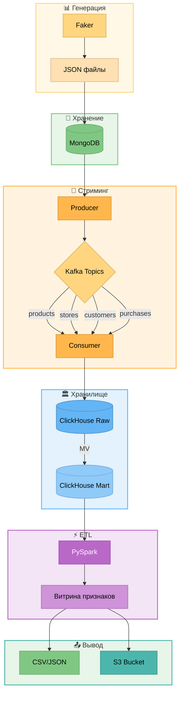
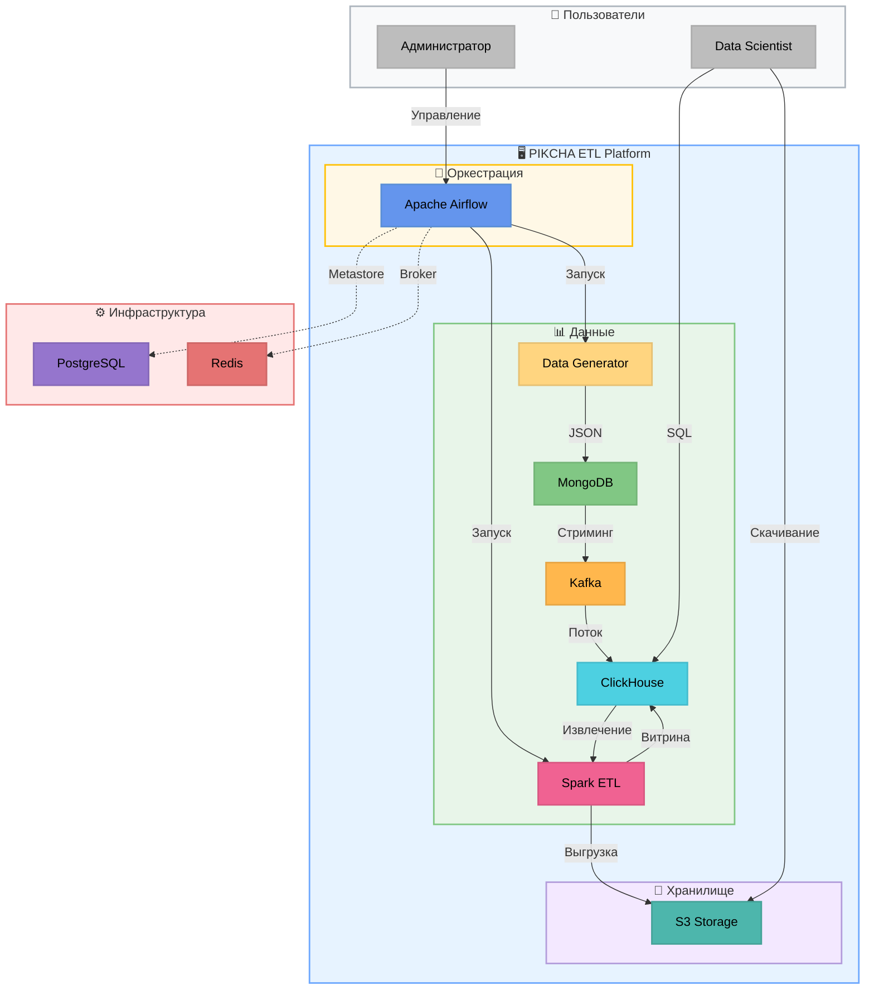
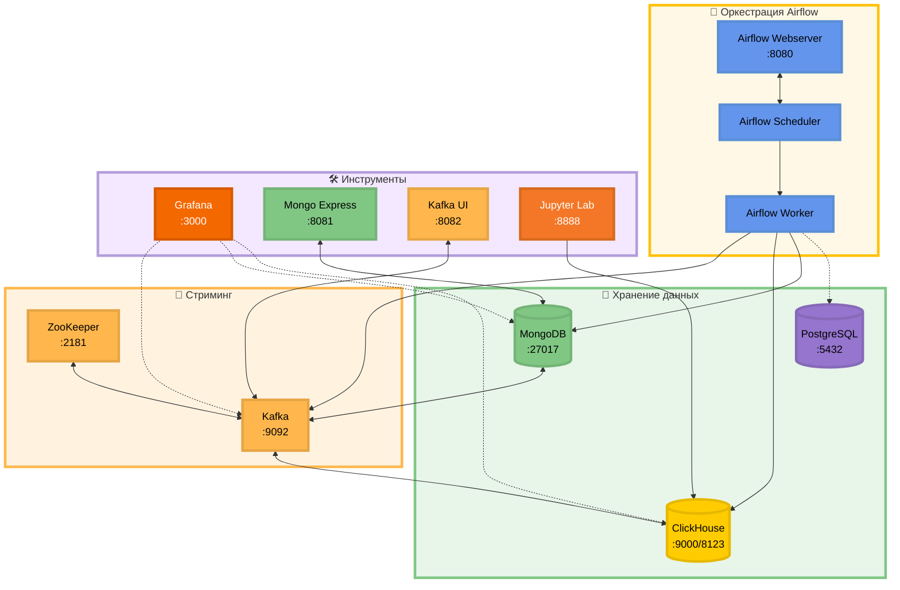
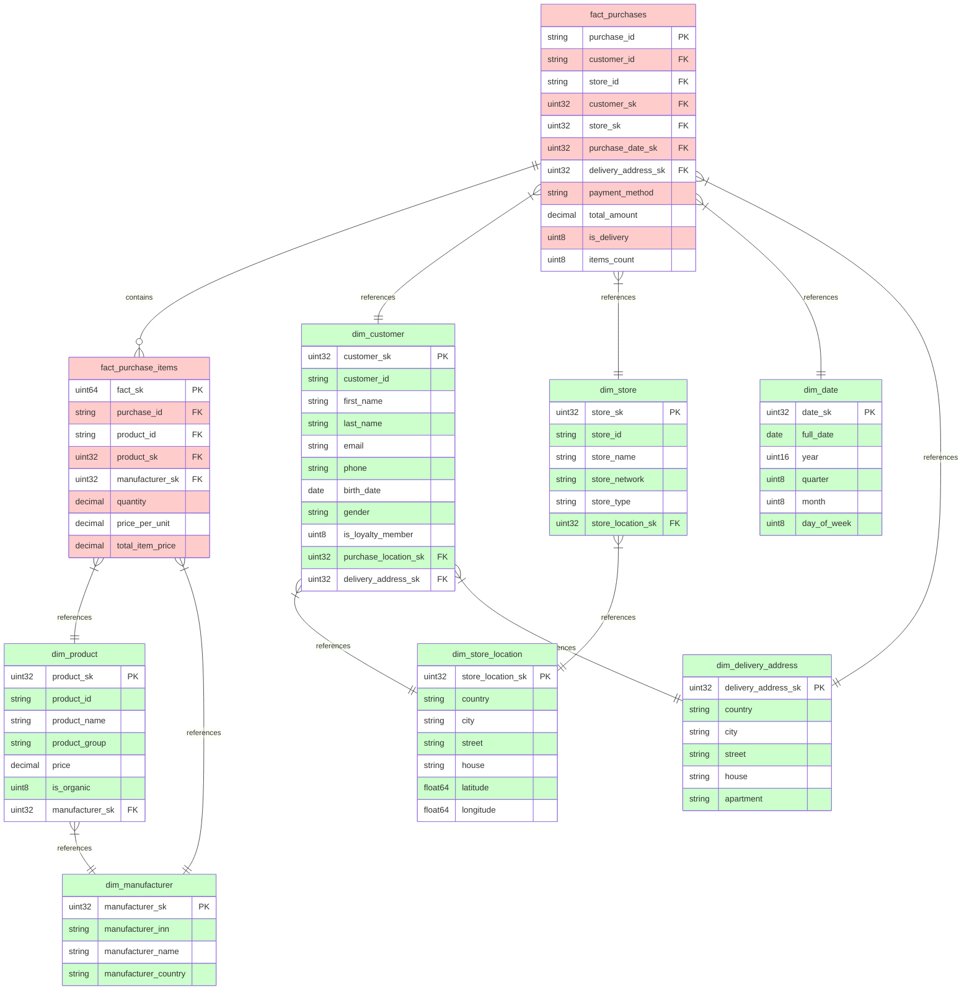
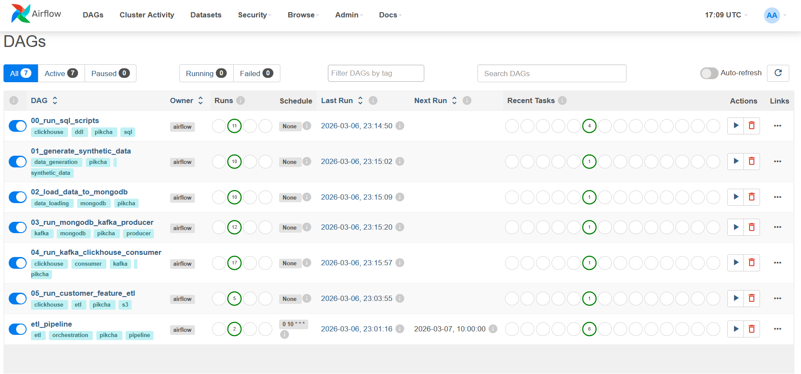
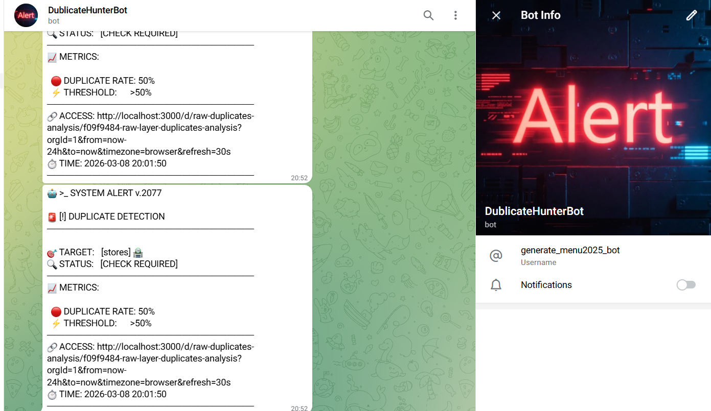

# ETL: CYBERPIKCHA_2077


[](https://selectel.ru/)

> Проект представляет собой комплексное ETL-решение для аналитической обработки данных розничной сети "CYBERPIKCHA 2077". Реализована сквозная архитектура от генерации синтетических данных до построения витрин для аналитики и ML-кластеризации.

Видеодемонстрация итогового проекта: [CYBERPIKCHA_2077: CLI](https://disk.yandex.ru/d/xZAK0uiQO7u1ag)<br>
Видеодемонстрация итогового проекта с Airflow: [CYBERPIKCHA_2077: AIRFLOW](https://disk.yandex.ru/i/2FGoykoCLoDkow)


---

## 📋 Оглавление

- [📁 Структура проекта](#-структура-проекта)
- [🛠 Технологический стек](#-технологический-стек)
- [🏗 Архитектура системы](#-архитектура-системы)
- [🗄 Структура данных](#-структура-данных)
- [⚙️ Развёртывание и конфигурация](#-развёртывание-и-конфигурация)
- [🚀 Запуск пайплайна](#-запуск-пайплайна)
- [🔁 Оркестрация с Apache Airflow](#-оркестрация-с-apache-airflow)
- [🔒 Безопасность](#-безопасность)
- [📊 Grafana Dashboards](#-grafana-dashboards)
- [🔧 Мониторинг и отладка](#-мониторинг-и-отладка)

---

## 📁 Структура проекта

```
pikcha_test_airflow/
├── airflow_config/                # Конфигурация Apache Airflow
│   └── webserver_config.py        # Настройки веб-сервера Airflow
│
├── config/                        # Конфигурация проекта
│   ├── __init__.py                # Экспорт настроек и логирования
│   ├── logging.py                 # Централизованное логирование
│   └── settings.py                # Dataclass-конфигурация
│
├── dags/                          # DAG-файлы Apache Airflow
│   ├── etl_pipeline.py            # Главный DAG оркестрации всего пайплайна
│   ├── generate_data_dag.py       # DAG генерации синтетических данных
│   ├── load_to_mongo_dag.py       # DAG загрузки данных в MongoDB
│   ├── run_producer_dag.py        # DAG Producer (MongoDB → Kafka)
│   ├── run_consumer_dag.py        # DAG Consumer (Kafka → ClickHouse)
│   ├── run_etl_dag.py             # DAG ETL витрины признаков
│   └── run_sql_scripts_dag.py     # DAG создания таблиц в ClickHouse
│
├── src/pikcha_etl/                # Основной ETL-модуль
│   ├── __init__.py
│   ├── types.py                   # Type aliases (JSONDict, StrPath)
│   ├── generation/                # Генерация синтетических данных
│   │   └── synthetic.py           # GroceryDataGenerator
│   ├── loader/                    # Загрузчики данных
│   │   └── mongo_loader.py        # MongoDataLoader
│   ├── pipeline/                  # Kafka пайплайны
│   │   ├── mongo_kafka_producer.py      # Producer: MongoDB → Kafka
│   │   └── kafka_clickhouse_consumer.py # Consumer: Kafka → ClickHouse
│   ├── etl/                       # Batch ETL процессы
│   │   ├── process.py             # CustomerFeatureETL (Spark)
│   │   ├── config.py              # ETL конфигурация
│   │   └── upload_to_s3.py        # Выгрузка в S3
│   └── utils/                     # Утилиты
│       ├── helpers.py             # Нормализация телефона/email
│       └── hashing.py             # HMAC-SHA256 хеширование
│
├── scripts/                       # CLI-скрипты запуска
│   ├── generate_data.py           # Генерация данных
│   ├── load_to_mongo.py           # Загрузка в MongoDB
│   ├── run_producer.py            # Producer (MongoDB → Kafka)
│   ├── run_consumer.py            # Consumer (Kafka → ClickHouse)
│   ├── run_etl.py                 # ETL витрины признаков
│   ├── cleanup_all.py             # Полная очистка данных (data/, MongoDB, Kafka, ClickHouse)
│   ├── dedup_mart.py              # Дедупликация таблиц mart-слоя (OPTIMIZE FINAL)
│   └── clickhouse-jdbc-0.4.6.jar  # JDBC драйвер для Spark
│
├── sql/                           # SQL-скрипты ClickHouse
│   ├── 00_create_raw_tables.sql       # Raw слой
│   ├── 01_create_mart_database.sql    # Mart слой + измерения/факты
│   ├── 02_create_materialized_views.sql # MV для автоматической загрузки
│   └── 03_create_customer_features_table.sql # Витрина признаков
│
├── ui/                            # UI компоненты
│   └── UI.html                    # HTML-файл интерфейса
│
├── grafana/                       # Конфигурация Grafana
│   ├── dashboards/                # JSON-файлы дашбордов
│   │   ├── customer_features_matrix.json    # Матрица признаков клиентов
│   │   ├── mart_duplicates_analysis.json    # Анализ дубликатов mart-слоя
│   │   ├── raw_duplicates_analysis.json     # Анализ дубликатов raw-слоя
│   │   ├── raw_layer_stats.json             # Статистика raw-слоя
│   │   └── stores_geo_map.json              # Гео-карта магазинов
│   ├── alerting/                  # Правила алертинга
│   │   ├── alert-rules.yml        # Правила и условия алертов
│   │   └── contact-points.yml     # Контактные точки (Telegram)
│   ├── datasources/               # Источники данных
│   │   └── clickhouse.yml         # Подключение к ClickHouse
│   └── provisioning/              # Провижининг конфигурации
│       └── dashboards.yml         # Настройка загрузки дашбордов
│
├── data/                          # Сгенерированные JSON данные
├── output/                        # Результаты ETL (CSV/JSON)
├── logs/                          # Логи выполнения
├── docs/                          # Документация
│   └── architecture.md            # Подробная архитектура системы
│
├── docker-compose.yml             # Инфраструктура контейнеров
├── Dockerfile.airflow             # Dockerfile для Airflow
├── Dockerfile.jupyter             # Dockerfile для Jupyter
├── requirements.txt               # Python зависимости
├── .env.example                   # Пример конфигурации
├── .gitignore                     # Git ignore файл
└── README.md                      # Этот файл
```

---

## 🛠 Технологический стек

| Категория | Технология | Назначение |
|-----------|------------|------------|
| **Язык** | Python 3.12+ | Основная разработка |
| **Оркестрация** | Apache Airflow 2.9.2 | Оркестрация ETL-пайплайнов |
| **Базы данных** | MongoDB 6.0 | Операционное хранение JSON |
| | ClickHouse 25.7 | Аналитическое хранилище |
| | PostgreSQL 13 | Metastore для Airflow |
| **Стриминг** | Apache Kafka 7.5 | Передача данных между слоями |
| | Zookeeper 7.3.3 | Координация Kafka |
| **Обработка** | PySpark 3.5+ | Batch ETL трансформации |
| **Визуализация** | Grafana | Дашборды и мониторинг |
| **Инфраструктура** | Docker | Контейнеризация сервисов |
| **Хранилище** | S3 (Selectel/AWS) | Архивирование результатов |

**Основные библиотеки Python:**
- `pymongo` — работа с MongoDB
- `kafka-python`, `confluent-kafka` — Producer/Consumer Kafka
- `clickhouse-driver` — клиент ClickHouse
- `boto3` — интеграция с S3
- `faker` — генерация синтетических данных
- `python-dotenv` — управление конфигурацией
- `apache-airflow` — оркестрация пайплайнов
- `pyspark` — ETL трансформации

---

## 🏗 Архитектура системы

Подробная архитектура в файле [architecture.md](docs/architecture.md).

### Диаграмма потока данных 



### Компоненты системы 



### 🐳 Архитектура Docker



**Описание компонентов:**

| Компонент | Порт | Назначение |
|-----------|------|------------|
| **airflow-webserver** | 8080 | Веб-интерфейс Apache Airflow |
| **airflow-scheduler** | — | Планировщик DAG-ов |
| **airflow-worker** | — | Выполнение задач (Celery) |
| **airflow-triggerer** | — | Асинхронные триггеры |
| **mongo** | 27017 | MongoDB для операционных данных |
| **clickhouse** | 9000/8123 | ClickHouse для аналитики |
| **postgres** | 5432 | Metastore для Airflow |
| **zookeeper** | 2181 | Координация Kafka |
| **kafka** | 9092/29092 | Брокер сообщений |
| **grafana** | 3000 | Визуализация и мониторинг |
| **mongo-express** | 8081 | Веб-UI для MongoDB |
| **kafka-ui** | 8082 | Веб-UI для Kafka |
| **jupyter** | 8888 | Jupyter Lab для аналитики |

---

## 🗄 Структура данных

### Raw слой (сырые данные)

| Таблица | Источник | Описание |
|---------|----------|----------|
| `raw.stores` | Kafka `stores` | Магазины с локацией и менеджерами |
| `raw.products` | Kafka `products` | Товары с КБЖУ и производителями |
| `raw.customers` | Kafka `customers` | Клиенты с предпочтениями |
| `raw.purchases` | Kafka `purchases` | Покупки с Nested-позициями товаров |

**Движок:** `MergeTree()`
**Партиционирование:** по месяцам
**TTL:** 180 дней

---

### Mart слой (витрины данных)

#### Схема данных



#### Измерения (Dimensions)

| Таблица | Ключ | Атрибуты |
|---------|------|----------|
| `dim_manufacturer` | `manufacturer_sk` | ИНН, название, страна, сайт |
| `dim_store_location` | `store_location_sk` | Страна, город, улица, координаты |
| `dim_delivery_address` | `delivery_address_sk` | Страна, город, улица, квартира |
| `dim_product` | `product_sk` | Название, группа, КБЖУ, цена, organic |
| `dim_customer` | `customer_sk` | ФИО, email, телефон, лояльность, предпочтения |
| `dim_store` | `store_sk` | Название, сеть, тип, часы работы, флаги |
| `dim_date` | `date_sk` | Дата, год, квартал, месяц, неделя, день |

#### Факты (Fact Tables)

| Таблица | Ключ | Метрики |
|---------|------|---------|
| `fact_purchases` | `purchase_id` | `total_amount`, `items_count`, `is_delivery` |
| `fact_purchase_items` | `fact_sk` | `quantity`, `price_per_unit`, `total_item_price` |

---

### Витрина признаков клиентов

Таблица `mart.customer_features_mart` содержит **30 бинарных признаков** для ML-кластеризации:

| Категория | Признак | Описание |
|-----------|---------|----------|
| **product_preference** | `bought_milk_last_30d` | Покупал молочные продукты за 30 дней |
| | `bought_fruits_last_14d` | Покупал фрукты/ягоды за 14 дней |
| | `not_bought_veggies_14d` | Не покупал овощи/зелень за 14 дня |
| | `organic_preference` | Купил органический продукт |
| | `buys_bakery` | Покупал хлеб/выпечку |
| | `bought_meat_last_week` | Покупал мясо/рыбу/яйца за 7 дней |
| | `fruit_lover` | ≥3 покупок фруктов за 30 дней |
| | `vegetarian_profile` | Нет мясных продуктов за 90 дней |
| **purchase_behavior** | `recurrent_buyer` | >2 покупок за 30 дней |
| | `inactive_14_30` | Не покупал 14-30 дней |
| | `delivery_user` | Пользовался доставкой |
| | `no_purchases` | Нет покупок (только регистрация) |
| **loyalty** | `new_customer` | Зарегистрировался <30 дней назад |
| | `loyal_customer` | Карта лояльности + ≥3 покупки |
| **spending** | `bulk_buyer` | Средняя корзина >1000₽ |
| | `low_cost_buyer` | Средняя корзина <200₽ |
| | `recent_high_spender` | >2000₽ за последние 7 дней |
| **temporal** | `night_shopper` | Покупки после 20:00 |
| | `morning_shopper` | Покупки до 10:00 |
| | `weekend_shopper` | ≥60% покупок в выходные |
| | `weekday_shopper` | ≥60% покупок в будни |
| | `early_bird` | Покупки 12:00-15:00 |
| **payment** | `prefers_cash` | ≥70% оплат наличными |
| | `prefers_card` | ≥70% оплат картой |
| **location** | `multicity_buyer` | Покупки в разных городах |
| | `store_loyal` | Один магазин |
| | `switching_store` | Разные магазины |
| **basket** | `single_item_buyer` | ≥50% покупок — 1 товар |
| | `varied_shopper` | ≥4 категорий продуктов |
| | `family_shopper` | Среднее кол-во позиций ≥4 |

**Дополнительные метрики:**
- `total_purchases` — общее количество покупок
- `total_spent` — общая сумма
- `avg_cart_amount` — средняя корзина

---

## ⚙️ Развёртывание и конфигурация

### 📋 Предварительные требования

| Требование | Версия | Примечание |
|------------|--------|------------|
| **Python** | 3.12+ | Основная среда выполнения |
| **Docker** | 20.10+ | Контейнеризация сервисов |
| **Docker Compose** | 2.0+ | Оркестрация контейнеров |
| **Git** | 2.30+ | Система контроля версий |
| **RAM** | 8 ГБ+ | Рекомендуется 16 ГБ для полной инфраструктуры |
| **Disk** | 10 ГБ+ | Свободное место для данных и логов |

---

### 🔧 Шаг 1: Клонирование репозитория

```bash
# Клонирование репозитория
git clone <repository-url>
cd pikcha_test_airflow

# Создание виртуального окружения (рекомендуется)
python -m venv .venv

# Активация виртуального окружения
# Windows (PowerShell)
.venv\Scripts\Activate.ps1
# Linux/macOS
source .venv/bin/activate

# Установка зависимостей
pip install -r requirements.txt
```

---

### 📝 Шаг 2: Настройка переменных окружения

**Создайте файл `.env` на основе примера:**

```bash
cp .env.example .env
```

**Обязательные переменные для настройки:**

| Переменная | Описание | Пример значения |
|------------|----------|-----------------|
| `HMAC_SECRET_KEY` | Ключ для HMAC-хеширования чувствительных данных | `my-super-secret-key-2077` |
| `MONGO_URI` | URI подключения к MongoDB (автоматически определяется для Docker) | `mongodb://localhost:27017` |
| `CLICKHOUSE_HOST` | Хост ClickHouse (автоматически определяется для Docker) | `localhost` |
| `KAFKA_BROKER` | Адрес Kafka брокера (автоматически определяется для Docker) | `localhost:9092` |
| `S3_ACCESS_KEY` | Ключ доступа к S3 (если используется) | `your-access-key` |
| `S3_SECRET_KEY` | Секретный ключ S3 (если используется) | `your-secret-key` |
| `TELEGRAM_BOT_TOKEN` | Токен бота для алертов (опционально) | `1234567890:AAH...` |
| `TELEGRAM_CHAT_ID` | ID чата для уведомлений (опционально) | `123456789` |

**Полная конфигурация `.env`:**

```bash
# ===========================================
# PIKCHA ETL Configuration
# ===========================================

# MongoDB
# Для локальной разработки: mongodb://localhost:27017
# Для Docker: mongodb://mongo_db_pikcha_airflow:27017 (автоматически определяется в settings.py)
MONGO_URI=
MONGO_DATABASE=mongo_db

# MongoDB Express (Web UI)
MONGO_EXPRESS_USER=admin
MONGO_EXPRESS_PASS=pass

# ClickHouse
# Для локальной разработки: localhost
# Для Docker: clickhouse (автоматически определяется в settings.py)
CLICKHOUSE_HOST=
CLICKHOUSE_HTTP_PORT=8123
CLICKHOUSE_NATIVE_PORT=9000
CLICKHOUSE_DATABASE=mart
CLICKHOUSE_RAW_DB=raw
CLICKHOUSE_USER=clickhouse
CLICKHOUSE_PASSWORD=clickhouse

# Kafka
# Для локальной разработки: localhost:9092
# Для Docker: kafka:29092 (автоматически определяется в settings.py)
KAFKA_BROKER=
KAFKA_GROUP=pikcha-consumer-group
KAFKA_CLUSTER_NAME=my-cluster

# Kafka Admin (для очистки топиков)
KAFKA_ADMIN_BROKER=localhost:9092

# Kafka Topics (список топиков через запятую)
KAFKA_TOPICS=stores,customers,products,purchases

# Security (обязательно для продюсера)
HMAC_SECRET_KEY=your-secret-key-here

# S3 Configuration
S3_ENABLED=true
S3_ACCESS_KEY=
S3_SECRET_KEY=
S3_ENDPOINT=https://s3.ru-7.storage.selcloud.ru
S3_BUCKET=de-internship-pikcha
S3_REGION=ru-7

# Output (для ETL)
OUTPUT_DIR=output
CSV_FILENAME_PREFIX=analytic_result

# Data (для генерации и очистки)
DATA_DIR=data

# Data Subdirs (список подпапок для очистки)
DATA_SUBDIRS=customers,products,purchases,stores,spark

# Grafana
GRAFANA_ADMIN_USER=admin
GRAFANA_ADMIN_PASSWORD=admin

# Telegram Alerts (для уведомлений о дубликатах)
# Получите токен бота через @BotFather
TELEGRAM_BOT_TOKEN=
# Получите Chat ID через @userinfobot или @JsonDumpBot
TELEGRAM_CHAT_ID=

# Zookeeper
ZOOKEEPER_PORT=2181
```

---

### 🐳 Шаг 3: Развёртывание инфраструктуры (Docker)

**Инфраструктура включает:**

| Сервис | Порт | Назначение |
|--------|------|------------|
| `airflow-webserver` | 8080 | Веб-интерфейс Airflow |
| `airflow-scheduler` | — | Планировщик DAG-ов |
| `airflow-worker` | — | Выполнение задач |
| `airflow-triggerer` | — | Асинхронные триггеры |
| `postgres` | 5432 | Metastore для Airflow |
| `redis` | 6379 | Брокер сообщений Celery |
| `mongo` | 27017 | MongoDB для операционных данных |
| `clickhouse` | 9000/8123 | ClickHouse для аналитики |
| `zookeeper` | 2181 | Координация Kafka |
| `kafka` | 9092/29092 | Брокер сообщений |
| `grafana` | 3000 | Визуализация и мониторинг |
| `mongo-express` | 8081 | Веб-UI для MongoDB |
| `kafka-ui` | 8082 | Веб-UI для Kafka |
| `jupyter` | 8888 | Jupyter Lab для аналитики |

**Запуск инфраструктуры:**

```bash
# 1. Инициализация Airflow (первый запуск)
# Создаёт пользователя и инициализирует базу данных
docker-compose up airflow-init

# 2. Запуск всех сервисов в фоновом режиме
docker-compose up -d

# 3. Проверка статуса контейнеров
docker-compose ps

# 4. Просмотр логов
docker-compose logs -f
```

**Остановка инфраструктуры:**

```bash
# Остановка всех сервисов
docker-compose down

# Остановка с удалением томов (данные будут удалены!)
docker-compose down -v

# Остановка конкретных сервисов
docker-compose down mongo clickhouse kafka
```

---

### 🔌 Шаг 4: Проверка подключения к сервисам

**Airflow:**
```bash
# Проверка доступности веб-интерфейса
curl http://localhost:8080

# Логин/пароль: airflow / airflow
```

**MongoDB:**
```bash
# Подключение через mongosh
mongosh mongodb://localhost:27017/mongo_db

# Или через Docker
docker-compose exec mongo mongosh mongodb://localhost:27017/mongo_db
```

**ClickHouse:**
```bash
# Подключение через clickhouse-client
clickhouse-client --host localhost --port 9000 \
  --user clickhouse --password clickhouse

# Или через Docker
docker-compose exec clickhouse clickhouse-client \
  --user clickhouse --password clickhouse
```

**Kafka:**
```bash
# Проверка брокера через kafka-ui (веб-интерфейс)
# http://localhost:8082

# Или через Docker
docker-compose exec kafka kafka-topics --bootstrap-server localhost:9092 --list
```

**Grafana:**
```bash
# Проверка доступности веб-интерфейса
curl http://localhost:3000

# Логин/пароль: admin / admin
```

---

### 🗂️ Шаг 5: Инициализация базы данных ClickHouse

**Создание таблиц RAW и MART слоёв:**

```bash
# Полная инициализация (с подтверждением)
python scripts/init_clickhouse.py --confirm

# Сухой запуск (показать SQL без выполнения)
python scripts/init_clickhouse.py --dry-run

# Только RAW-слой
python scripts/init_clickhouse.py --raw-only --confirm

# Только MART-слой
python scripts/init_clickhouse.py --mart-only --confirm
```

**Что создаётся:**
- База данных `raw` (таблицы: `stores`, `products`, `customers`, `purchases`)
- База данных `mart` (таблицы: `dim_*`, `fact_*`, `customer_features_mart`)
- Materialized Views для автоматической загрузки данных

📄 **Лог:** `logs/init_clickhouse.log`

---

### ✅ Шаг 6: Проверка работоспособности

**Чек-лист успешного развёртывания:**

- [ ] Все контейнеры запущены (`docker-compose ps` показывает `Up`)
- [ ] Airflow доступен по http://localhost:8080
- [ ] Grafana доступна по http://localhost:3000
- [ ] MongoDB подключается через mongosh
- [ ] ClickHouse подключается через clickhouse-client
- [ ] Kafka UI доступен по http://localhost:8082
- [ ] Таблицы в ClickHouse созданы (`SHOW TABLES FROM raw;`, `SHOW TABLES FROM mart;`)

**Тестовый запуск пайплайна:**

```bash
# 1. Генерация тестовых данных
python scripts/generate_data.py -n 50

# 2. Загрузка в MongoDB
python scripts/load_to_mongo.py

# 3. Проверка данных в MongoDB
docker-compose exec mongo mongosh mongodb://localhost:27017/mongo_db --eval "db.stores.count()"

# 4. Запуск Producer
python scripts/run_producer.py

# 5. Запуск Consumer (однократный режим)
python scripts/run_consumer.py --once --timeout 60

# 6. Проверка данных в ClickHouse
docker-compose exec clickhouse clickhouse-client \
  --query "SELECT count() FROM raw.stores;"
```

---

### 🔧 Управление конфигурацией

#### Переменные окружения в Docker

**Файл `.env` автоматически используется Docker Compose:**

```yaml
# docker-compose.yml (фрагмент)
services:
  airflow-worker:
    env_file:
      - .env
    environment:
      - MONGO_URI=${MONGO_URI:-mongodb://mongo:27017}
      - CLICKHOUSE_HOST=${CLICKHOUSE_HOST:-clickhouse}
```

#### Автоопределение окружения

**Модуль `config/settings.py` автоматически определяет окружение:**

```python
# Внутри Docker
MONGO_URI = "mongodb://mongo_db_pikcha_airflow:27017"
CLICKHOUSE_HOST = "clickhouse"
KAFKA_BROKER = "kafka:29092"

# Локальная разработка
MONGO_URI = "mongodb://localhost:27017"
CLICKHOUSE_HOST = "localhost"
KAFKA_BROKER = "localhost:9092"
```

---

### 📊 Настройка Grafana

**Импорт дашбордов:**

Дашборды автоматически загружаются при старте Grafana из папки `grafana/dashboards/`.

**Ручной импорт (опционально):**
1. Открыть http://localhost:3000
2. Перейти: Dashboards → Import
3. Загрузить JSON-файл из `grafana/dashboards/`
4. Выбрать источник данных: `ClickHouse`

**Настройка алертинга:**
1. Перейти: Alerting → Contact points
2. Добавить Telegram-бота (токен из `.env`)
3. Указать Chat ID для уведомлений

---

### 📁 Структура директорий после развёртывания

```
pikcha_test_airflow/
├── .env                         # Конфигурация (создаётся вручную)
├── data/                        # Сгенерированные данные
│   ├── stores/
│   ├── products/
│   ├── customers/
│   └── purchases/
├── output/                      # Результаты ETL
│   ├── csv/
│   └── json/
├── logs/                        # Логи выполнения
│   ├── init_clickhouse.log
│   ├── generate_data.log
│   ├── load_to_mongo.log
│   ├── run_producer.log
│   ├── run_consumer.log
│   ├── run_etl.log
│   └── ...
└── airflow_config/              # Конфигурация Airflow
    └── webserver_config.py
```

---

## 🚀 Запуск пайплайна

ETL-пайплайн состоит из 6 последовательных шагов. Каждый шаг может выполняться как через Apache Airflow, так и вручную через CLI.

---

### Шаг 0: Инициализация таблиц в ClickHouse

**Скрипт:** `scripts/init_clickhouse.py`

Создаёт структуру базы данных ClickHouse: RAW-слой (сырые данные) и MART-слой (витрины).

```bash
# Базовый запуск (с подтверждением)
python scripts/init_clickhouse.py --confirm

# Сухой запуск (показать SQL без выполнения)
python scripts/init_clickhouse.py --dry-run

# Только RAW-слой
python scripts/init_clickhouse.py --raw-only --confirm

# Только MART-слой (требует существующего RAW)
python scripts/init_clickhouse.py --mart-only --confirm

# Полная очистка и пересоздание
python scripts/init_clickhouse.py --drop-existing --confirm
```

**Все параметры:**

| Параметр | Краткая форма | Описание | Значение по умолчанию |
|----------|---------------|----------|----------------------|
| `--confirm` | `-c` | Запросить подтверждение перед выполнением | — |
| `--dry-run` | `-n` | Показать SQL-команды без выполнения | — |
| `--raw-only` | `-r` | Создать только RAW-слой | — |
| `--mart-only` | `-m` | Создать только MART-слой | — |
| `--drop-existing` | `-d` | Удалить существующие БД перед созданием | — |
| `--clickhouse-host` | `-h` | Хост ClickHouse | `localhost` (или `clickhouse` в Docker) |
| `--clickhouse-port` | `-p` | Порт ClickHouse (native) | `9000` |
| `--clickhouse-user` | `-u` | Пользователь ClickHouse | `clickhouse` |
| `--clickhouse-password` | `-w` | Пароль ClickHouse | `clickhouse` |

**Порядок выполнения:**
1. Создание базы данных `raw`
2. Создание таблиц raw-слоя (`stores`, `products`, `customers`, `purchases`)
3. Создание базы данных `mart`
4. Создание таблиц mart-слоя (`dim_*`, `fact_*`, `customer_features_mart`)
5. Создание Materialized Views для автоматической загрузки

📄 **Лог:** `logs/init_clickhouse.log`


---

### Шаг 1: Генерация синтетических данных

**Скрипт:** `scripts/generate_data.py`

Генерирует реалистичные тестовые данные для розничной сети: магазины, товары, покупатели, покупки.

```bash
# Генерация по умолчанию (45 магазинов, 50 товаров, 45 покупателей, 200 покупок)
python scripts/generate_data.py

# Генерация с кастомным количеством объектов
python scripts/generate_data.py \
    --num-stores 100 \
    --num-products 200 \
    --num-customers 500 \
    --num-purchases 1000

# Краткая форма (только покупки)
python scripts/generate_data.py -n 1000

# Указать директорию вывода
python scripts/generate_data.py -o /path/to/data
```

**Все параметры:**

| Параметр | Краткая форма | Описание | Значение по умолчанию |
|----------|---------------|----------|----------------------|
| `--num-stores` | `-s` | Количество магазинов | `45` (30 + 15 по сетям) |
| `--num-products` | `-p` | Количество товаров | `50` (по 10 из категории) |
| `--num-customers` | `-c` | Количество покупателей | `= количеству магазинов` |
| `--num-purchases` | `-n` | Количество покупок | `200` |
| `--output-dir` | `-o` | Директория для сохранения данных | `data` |

**Результат:**
```
data/
├── stores/           # 45 файлов (store-001.json ... store-045.json)
├── products/         # 50 файлов (prd-1000.json ... prd-1049.json)
├── customers/        # 45 файлов (cus-1000.json ... cus-1044.json)
└── purchases/        # 200 файлов (ord-00001.json ... ord-00200.json)
```

**Гибкая настройка через Python API:**
```python
from src.pikcha_etl.generation.synthetic import GroceryDataGenerator

generator = GroceryDataGenerator()
result = generator.run(
    num_stores=100,        # 100 магазинов
    num_products=200,      # 200 товаров
    num_customers=500,     # 500 покупателей
    num_purchases=1000     # 1000 покупок
)
print(result)  # {'stores': 100, 'products': 200, 'customers': 500, 'purchases': 1000}
```

📄 **Лог:** `logs/generate_data.log`

---

### Шаг 2: Загрузка данных в MongoDB

**Скрипт:** `scripts/load_to_mongo.py`

Загружает JSON-файлы из директории `data/` в коллекции MongoDB.

```bash
# Базовая загрузка (с очисткой коллекций)
python scripts/load_to_mongo.py --data-dir data

# Загрузка без очистки (добавление к существующим данным)
python scripts/load_to_mongo.py --data-dir data --no-clear

# Указать кастомный MongoDB URI
python scripts/load_to_mongo.py -m mongodb://192.168.1.100:27017 -d my_database
```

**Все параметры:**

| Параметр | Краткая форма | Описание | Значение по умолчанию |
|----------|---------------|----------|----------------------|
| `--mongo-uri` | `-m` | URI подключения к MongoDB | из `.env` (`MONGO_URI`) |
| `--database` | `-d` | Имя базы данных MongoDB | из `.env` (`MONGO_DATABASE`) |
| `--data-dir` | `-i` | Директория с JSON-файлами | `data` |
| `--no-clear` | `-n` | Не очищать коллекции перед загрузкой | — |

**Коллекции MongoDB:**
- `stores` ← файлы из `data/stores/`
- `products` ← файлы из `data/products/`
- `customers` ← файлы из `data/customers/`
- `purchases` ← файлы из `data/purchases/`

📄 **Лог:** `logs/load_to_mongo.log`

---

### Шаг 3: Producer (MongoDB → Kafka)

**Скрипт:** `scripts/run_producer.py`

Читает данные из MongoDB, хеширует чувствительные поля и отправляет в топики Kafka.

```bash
# Базовый запуск (все топики)
python scripts/run_producer.py

# Указать конкретные топики
python scripts/run_producer.py --topics stores customers

# Указать кастомный HMAC-ключ
python scripts/run_producer.py --hmac-key my-secret-key
```

**Все параметры:**

| Параметр | Краткая форма | Описание | Значение по умолчанию |
|----------|---------------|----------|----------------------|
| `--mongo-uri` | `-m` | URI подключения к MongoDB | из `.env` |
| `--mongo-db` | `-d` | Имя базы данных MongoDB | из `.env` |
| `--kafka-broker` | `-k` | Адрес Kafka брокера | из `.env` |
| `--topics` | `-t` | Список топиков для обработки | `stores customers products purchases` |
| `--hmac-key` | `-h` | Секретный ключ для HMAC-хеширования | из `.env` (`HMAC_SECRET_KEY`) |

**Топики Kafka:**
| Топик | Описание |
|-------|----------|
| `stores` | Данные о магазинах |
| `products` | Каталог товаров |
| `customers` | Профили клиентов |
| `purchases` | История покупок |

📄 **Лог:** `logs/run_producer.log`

---

### Шаг 4: Consumer (Kafka → ClickHouse)

**Скрипт:** `scripts/run_consumer.py`

Подписывается на топики Kafka и записывает сообщения в таблицы RAW-слоя ClickHouse.

```bash
# Базовый запуск (постоянная подписка)
python scripts/run_consumer.py

# Однократная обработка (обработать и выйти)
python scripts/run_consumer.py --once

# Однократная обработка с таймаутом
python scripts/run_consumer.py --once --timeout 600

# Указать конкретные топики
python scripts/run_consumer.py --topics stores products
```

**Все параметры:**

| Параметр | Краткая форма | Описание | Значение по умолчанию |
|----------|---------------|----------|----------------------|
| `--clickhouse-host` | `-ch` | Хост ClickHouse | из `.env` |
| `--clickhouse-port` | `-cp` | Порт ClickHouse (native) | `9000` |
| `--clickhouse-user` | `-cu` | Пользователь ClickHouse | `clickhouse` |
| `--clickhouse-password` | `-cw` | Пароль ClickHouse | `clickhouse` |
| `--clickhouse-raw-db` | `-cd` | База данных для сырых данных | `raw` |
| `--kafka-broker` | `-kb` | Адрес Kafka брокера | из `.env` |
| `--kafka-group` | `-kg` | ID группы консюмеров | из `.env` |
| `--topics` | `-t` | Список топиков для подписки | `stores customers products purchases` |
| `--once` | `-o` | Обработать сообщения и выйти | — |
| `--timeout` | `-T` | Таймаут для режима `--once` (сек) | `300` |

**Режимы работы:**
- **Постоянная подписка** (по умолчанию) — бесконечный цикл ожидания новых сообщений
- **Однократная обработка** (`--once`) — обработать накопленные сообщения и завершить работу

📄 **Лог:** `logs/run_consumer.log`

---

### Шаг 5: ETL витрины признаков (Spark)

**Скрипт:** `scripts/run_etl.py`

Запускает ETL-процесс на базе Apache Spark для расчёта 30 бинарных признаков клиентов.

```bash
# Вывод во все форматы (ClickHouse + CSV + JSON)
python scripts/run_etl.py --output-format all

# Только загрузка в ClickHouse
python scripts/run_etl.py -f clickhouse

# Только выгрузка в CSV
python scripts/run_etl.py -f csv

# Указать дату витрины
python scripts/run_etl.py --date 2024-03-15

# Загрузка результатов в S3
python scripts/run_etl.py --upload-s3 --s3-format csv
```

**Все параметры:**

| Параметр | Краткая форма | Описание | Значение по умолчанию |
|----------|---------------|----------|----------------------|
| `--output-format` | `-f` | Формат вывода | `all` |
| | | `clickhouse` — только ClickHouse | |
| | | `csv` — только CSV | |
| | | `json` — только JSON | |
| | | `all` — все форматы | |
| `--date` | `-d` | Дата витрины (YYYY-MM-DD) | текущая дата |
| `--upload-s3` | `-s` | Загрузить результаты в S3 | — |
| `--s3-format` | `-sf` | Формат файлов для S3 | `all` |
| | | `csv`, `json`, `all` | |

**Рассчитываемые признаки (30 штук):**

| Категория | Признаки |
|-----------|----------|
| **product_preference** (8) | `bought_milk_last_30d`, `bought_fruits_last_14d`, `not_bought_veggies_14d`, `organic_preference`, `buys_bakery`, `bought_meat_last_week`, `fruit_lover`, `vegetarian_profile` |
| **purchase_behavior** (4) | `recurrent_buyer`, `inactive_14_30`, `delivery_user`, `no_purchases` |
| **loyalty** (2) | `new_customer`, `loyal_customer` |
| **spending** (3) | `bulk_buyer`, `low_cost_buyer`, `recent_high_spender` |
| **temporal** (5) | `night_shopper`, `morning_shopper`, `weekend_shopper`, `weekday_shopper`, `early_bird` |
| **payment** (2) | `prefers_cash`, `prefers_card` |
| **location** (3) | `multicity_buyer`, `store_loyal`, `switching_store` |
| **basket** (3) | `single_item_buyer`, `varied_shopper`, `family_shopper` |

📄 **Лог:** `logs/run_etl.log`

---

### Дополнительные утилиты

#### Очистка всех данных

**Скрипт:** `scripts/cleanup_all.py`

Полностью удаляет все данные проекта: `data/`, MongoDB, Kafka, ClickHouse.

```bash
# Полная очистка (с подтверждением)
python scripts/cleanup_all.py

# Автоматическая очистка (без подтверждения)
python scripts/cleanup_all.py --yes

# Только очистка ClickHouse
python scripts/cleanup_all.py --skip-mongo --skip-kafka --skip-data --yes

# Только очистка MongoDB и Kafka
python scripts/cleanup_all.py --skip-clickhouse --skip-data --yes
```

**Все параметры:**

| Параметр | Краткая форма | Описание |
|----------|---------------|----------|
| `--mongo-uri` | `-m` | URI подключения к MongoDB |
| `--mongo-database` | `-d` | Имя базы данных MongoDB |
| `--clickhouse-host` | `-ch` | Хост ClickHouse |
| `--clickhouse-port` | `-cp` | Порт ClickHouse |
| `--clickhouse-user` | `-cu` | Пользователь ClickHouse |
| `--clickhouse-password` | `-cw` | Пароль ClickHouse |
| `--clickhouse-raw-db` | `-cr` | Имя RAW базы данных |
| `--clickhouse-mart-db` | `-cm` | Имя MART базы данных |
| `--kafka-broker` | `-k` | Адрес Kafka брокера |
| `--data-dir` | `-i` | Директория data |
| `--skip-mongo` | `-sm` | Пропустить очистку MongoDB |
| `--skip-kafka` | `-sk` | Пропустить очистку Kafka |
| `--skip-clickhouse` | `-sc` | Пропустить очистку ClickHouse |
| `--skip-data` | `-sd` | Пропустить очистку директории data |
| `--yes` | `-y` | Не запрашивать подтверждение |

📄 **Лог:** `logs/cleanup_all.log`

---

#### Дедупликация MART-слоя

**Скрипт:** `scripts/dedup_mart.py`

Удаляет дубликаты в таблицах MART-слоя с помощью `OPTIMIZE TABLE ... FINAL`.

```bash
# Анализ дубликатов (без удаления)
python scripts/dedup_mart.py --analyze-only

# Дедупликация всех таблиц (с подтверждением)
python scripts/dedup_mart.py

# Автоматическая дедупликация (без подтверждения)
python scripts/dedup_mart.py --force

# Только конкретные таблицы
python scripts/dedup_mart.py -t dim_customer,dim_store,fact_purchases

# Использовать DEDUPLICATE BY (более точный метод)
python scripts/dedup_mart.py --deduplicate-by --force

# Сохранить отчёт в JSON
python scripts/dedup_mart.py --save-report --force
```

**Все параметры:**

| Параметр | Краткая форма | Описание | Значение по умолчанию |
|----------|---------------|----------|----------------------|
| `--clickhouse-host` | `-ch` | Хост ClickHouse | из `.env` |
| `--clickhouse-port` | `-cp` | Порт ClickHouse | `9000` |
| `--clickhouse-user` | `-cu` | Пользователь ClickHouse | `clickhouse` |
| `--clickhouse-password` | `-cw` | Пароль ClickHouse | `clickhouse` |
| `--clickhouse-database` | `-cd` | База данных MART | `mart` |
| `--tables` | `-t` | Список таблиц через запятую | все из конфига |
| `--analyze-only` | `-a` | Только анализ (без удаления) | — |
| `--deduplicate-by` | `-d` | Использовать `DEDUPLICATE BY` | — |
| `--dry-run` | `-n` | Сухой запуск (показать план) | — |
| `--force` | `-y` | Не запрашивать подтверждение | — |
| `--save-report` | `-s` | Сохранить отчёт в JSON | — |
| `--report-dir` | `-r` | Директория для отчётов | `output` |

**Обрабатываемые таблицы:**
- **Dimensions:** `dim_manufacturer`, `dim_store_location`, `dim_delivery_address`, `dim_product`, `dim_customer`, `dim_store`, `dim_date`
- **Facts:** `fact_purchases`, `fact_purchase_items`
- **Mart:** `customer_features_mart`

📄 **Лог:** `logs/dedup_mart.log`

---

## 🔁 Оркестрация с Apache Airflow

Проект использует **Apache Airflow 2.9.2** для оркестрации ETL-пайплайна. Все задачи автоматизированы через DAG-и.

### DAG-файлы

| DAG | Файл | Расписание | Описание |
|-----|------|------------|----------|
| **00_run_sql_scripts** | `run_sql_scripts_dag.py` | По требованию | Создание таблиц в ClickHouse (Raw + Mart) |
| **01_generate_synthetic_data** | `generate_data_dag.py` | По требованию | Генерация синтетических данных (stores, products, customers, purchases) |
| **02_load_data_to_mongodb** | `load_to_mongo_dag.py` | По требованию | Загрузка JSON-файлов в коллекции MongoDB |
| **03_run_mongodb_kafka_producer** | `run_producer_dag.py` | По требованию | Producer: MongoDB → Kafka (4 топика) |
| **04_run_kafka_clickhouse_consumer** | `run_consumer_dag.py` | По требованию | Consumer: Kafka → ClickHouse Raw |
| **05_run_customer_feature_etl** | `run_etl_dag.py` | По требованию | ETL витрины признаков (ClickHouse + S3) |
| **etl_pipeline** | `etl_pipeline.py` | `0 10 * * *` (ежедневно в 10:00) | **Главный DAG** — оркестрация всего пайплайна |

### Главный пайплайн (etl_pipeline)

```
SQL Scripts → Generate Data → Load to MongoDB → Producer → Consumer → ETL
```

**Последовательность выполнения:**
1. `trigger_run_sql_scripts` — инициализация таблиц в ClickHouse (RAW + MART слои)
2. `trigger_generate_synthetic_data` — генерация синтетических данных
3. `trigger_load_data_to_mongodb` — загрузка JSON в MongoDB
4. `trigger_run_mongodb_kafka_producer` — стриминг данных в Kafka
5. `trigger_run_kafka_clickhouse_consumer` — загрузка данных в ClickHouse RAW
6. `trigger_run_customer_feature_etl` — расчёт витрины признаков (30 признаков)

**Альтернатива через CLI:**
```bash
# Шаг 0: Инициализация таблиц в ClickHouse
python scripts/init_clickhouse.py --confirm

# Шаг 1: Генерация данных
python scripts/generate_data.py

# Шаг 2: Загрузка в MongoDB
python scripts/load_to_mongo.py

# Шаг 3: Producer (MongoDB → Kafka)
python scripts/run_producer.py

# Шаг 4: Consumer (Kafka → ClickHouse)
python scripts/run_consumer.py

# Шаг 5: ETL витрины признаков
python scripts/run_etl.py --output-format all
```

### Запуск через Airflow

```bash
# 1. Инициализация Airflow (первый запуск)
docker-compose up airflow-init

# 2. Запуск всех сервисов
docker-compose up -d

# 3. Открыть веб-интерфейс
# http://localhost:8080 (логин/пароль: airflow/airflow)

# 4. Активировать главный DAG
# В веб-интерфейсе: etl_pipeline → Trigger DAG
```



### Airflow Connections

Airflow использует следующие подключения (настраиваются автоматически при инициализации):

| Connection ID | Тип | Хост | Порт | Описание |
|---------------|-----|------|------|----------|
| `spark_default` | Spark | spark://spark | 7077 | Подключение к Spark |
| `clickhouse_default` | ClickHouse | clickhouse | 9000 | Подключение к ClickHouse |
| `mongodb_default` | MongoDB | mongo | 27017 | Подключение к MongoDB |
| `kafka_default` | Generic | kafka | 29092 | Подключение к Kafka |

---

## 🔒 Безопасность

### HMAC-хеширование чувствительных данных

**Алгоритм:** HMAC-SHA256

**Хешируемые поля:**
- `customers.phone`
- `customers.email`
- `purchases.customer.phone`
- `purchases.customer.email`

**Процесс хеширования:**


**Пример преобразования:**

```python
# До
phone: "+7 (999) 123-45-67"
email: "Anna.Petrova@EXAMPLE.ru"

# После нормализации
phone: "+79991234567"
email: "anna.petrova@example.ru"

# После HMAC-SHA256
phone: "a3f2b8c1d4e5f6789012345678901234abcd5678..."
email: "b4c3d2e1f5a6b7c8d9e0f1a2b3c4d5e6f7a8b9c0..."
```

### Требования к ключу HMAC

**Генерация безопасного ключа:**

```bash
python -c "import secrets; print(secrets.token_hex(32))"
# Результат: 64-символьная hex-строка
```

| Параметр | Требование |
|----------|------------|
| **Минимальная длина** | 32 байта (256 бит) |
| **Алгоритм** | HMAC-SHA256 |
| **Хранение** | В секрете, не коммитить в Git |

**Настройка в `.env`:**

```bash
# Генерация и установка ключа
HMAC_SECRET_KEY=$(python -c "import secrets; print(secrets.token_hex(32))")
```

---

## 📊 Grafana Dashboards

Система мониторинга на базе **Grafana** предоставляет дашборды для визуализации данных ETL-пайплайна и алертинга в Telegram.

**Доступ:** http://localhost:3000 (логин/пароль: `admin` / `admin`)

---

### 📈 Дашборды

#### 1. 📊 RAW Layer Statistics
**Файл:** `raw_layer_stats.json` | **UID:** `raw-layer-stats`

Дашборд мониторинга сырых данных в ClickHouse (raw-слой).

**Панели:**
| Панель | Тип | Описание |
|--------|-----|----------|
| **📊 Total Records** | Stat | Общее количество записей во всех таблицах raw-слоя |
| **🏪 stores** | Stat | Количество записей в таблице `raw.stores` |
| **📦 products** | Stat | Количество записей в таблице `raw.products` |
| **👥 customers** | Stat | Количество записей в таблице `raw.customers` |
| **🛒 purchases** | Stat | Количество записей в таблице `raw.purchases` |
| **📊 Records per Table** | Pie Chart | Распределение записей по таблицам (проценты + значения) |
| **📈 Records Over Time (Hourly)** | Time Series | Динамика поступления данных по часам для каждой таблицы |
| **📋 Table Details (Records & Size)** | Table | Детальная статистика: записи и размер данных в МБ по таблицам |
| **⏰ Data Freshness** | Stat | Время, прошедшее с последней записи (в формате дней/часов) |
| **🕐 Last Update** | Stat | Дата и время последнего обновления данных |

**Обновление:** каждые 30 секунд


---

#### 2. 📊 MART Layer Statistics
**Файл:** `mart_layer_stats.json` | **UID:** `mart-layer-stats`

Дашборд мониторинга витрин данных в ClickHouse (mart-слой).

**Панели:**

| Панель | Тип | Описание |
|--------|-----|----------|
| **📊 Total Records** | Stat | Общее количество записей во всех таблицах mart-слоя |
| **🏭 dim_manufacturer** | Stat | Количество записей в справочнике производителей |
| **📍 dim_store_location** | Stat | Количество записей в справочнике локаций магазинов |
| **🏠 dim_delivery_address** | Stat | Количество записей в справочнике адресов доставки |
| **📦 dim_product** | Stat | Количество записей в справочнике продуктов |
| **👥 dim_customer** | Stat | Количество записей в справочнике клиентов |
| **🏪 dim_store** | Stat | Количество записей в справочнике магазинов |
| **📅 dim_date** | Stat | Количество записей в справочнике дат |
| **🛒 fact_purchases** | Stat | Количество записей в факте покупок |
| **📋 fact_purchase_items** | Stat | Количество записей в факте позиций покупок |
| **🧬 customer_features_mart** | Stat | Количество записей в витрине признаков клиентов |

**Обновление:** каждые 30 секунд


---

#### 3. 🔄 RAW Layer Duplicates Analysis
**Файл:** `raw_duplicates_analysis.json` | **UID:** `raw-duplicates-analysis`

Дашборд анализа дубликатов ключей в raw-слое для контроля качества данных.

**Панели:**
| Панель | Тип | Описание |
|--------|-----|----------|
| **🔄 Total Duplicate Records** | Stat | Общее количество дублирующихся записей по всем таблицам |
| **📊 Duplicates per Table (Bar)** | Bar Chart | Количество дубликатов по каждой таблице |
| **🏪 stores duplicates %** | Gauge | Процент дубликатов по `store_id` в `raw.stores` |
| **📦 products duplicates %** | Gauge | Процент дубликатов по `id` в `raw.products` |
| **👥 customers duplicates %** | Gauge | Процент дубликатов по `customer_id` в `raw.customers` |
| **🛒 purchases duplicates %** | Gauge | Процент дубликатов по `purchase_id` в `raw.purchases` |

**Пороги срабатывания:**
- 🟢 Зелёный: 0%
- 🔴 Красный: ≥49%

**Обновление:** каждые 30 секунд


---

#### 4. 🔄 MART Layer Duplicates Analysis
**Файл:** `mart_duplicates_analysis.json` | **UID:** `mart-duplicates-analysis`

Дашборд анализа дубликатов в mart-слое (витрины данных и факты).

**Панели:**
| Панель | Тип | Описание |
|--------|-----|----------|
| **🔄 Total Duplicate Records** | Stat | Общее количество дубликатов по всем таблицам mart-слоя |
| **🏭 dim_manufacturer duplicates %** | Gauge | Процент дубликатов по `manufacturer_sk` |
| **📍 dim_store_location duplicates %** | Gauge | Процент дубликатов по `store_location_sk` |
| **🏠 dim_delivery_address duplicates %** | Gauge | Процент дубликатов по `delivery_address_sk` |
| **👥 dim_customer duplicates %** | Gauge | Процент дубликатов по `customer_sk` |
| **📦 dim_product duplicates %** | Gauge | Процент дубликатов по `product_sk` |
| **🏪 dim_store duplicates %** | Gauge | Процент дубликатов по `store_sk` |
| **📅 dim_date duplicates %** | Gauge | Процент дубликатов по `date_sk` |
| **🛒 fact_purchases duplicates %** | Gauge | Процент дубликатов по `purchase_id` |
| **📋 fact_purchase_items duplicates %** | Gauge | Процент дубликатов по `fact_sk` |
| **📈 Duplicate Statistics by Table** | Table | Детальная статистика: всего записей, уникальных ключей, дубликатов, процент |

**Пороги срабатывания:**
- 🟢 Зелёный: 0%
- 🟡 Жёлтый: ≥10%
- 🔴 Красный: ≥49%

**Обновление:** каждые 30 секунд


---

#### 5. 🧬 Customer Features Matrix
**Файл:** `customer_features_matrix.json` | **UID:** `customer-features-matrix`

Дашборд визуализации 30 бинарных признаков клиентов для ML-кластеризации.

**Панели:**
| Панель | Тип | Описание |
|--------|-----|----------|
| **👥 Total Customers** | Stat | Общее количество клиентов в витрине |
| **🛒 Avg Purchases** | Stat | Среднее количество покупок на клиента |
| **💰 Avg Total Spent** | Stat | Средняя сумма затрат клиента (₽) |
| **🛍️ Avg Cart Amount** | Stat | Средний размер корзины (₽) |
| **💎 Loyal Customers** | Stat | Доля клиентов с картой лояльности (≥3 покупок) |
| **📊 Customer Features Matrix** | Heatmap Table | Матрица 30 признаков для топ-100 клиентов по тратам |

**Признаки в матрице (30 столбцов):**

| Категория | Признаки |
|-----------|----------|
| **product_preference** | `bought_milk_last_30d`, `bought_fruits_last_14d`, `not_bought_veggies_14d`, `organic_preference`, `buys_bakery`, `bought_meat_last_week`, `fruit_lover`, `vegetarian_profile` |
| **purchase_behavior** | `recurrent_buyer`, `inactive_14_30`, `delivery_user`, `no_purchases` |
| **loyalty** | `new_customer`, `loyal_customer` |
| **spending** | `bulk_buyer`, `low_cost_buyer`, `recent_high_spender` |
| **temporal** | `night_shopper`, `morning_shopper`, `weekend_shopper`, `weekday_shopper`, `early_bird` |
| **payment** | `prefers_cash`, `prefers_card` |
| **location** | `multicity_buyer`, `store_loyal`, `switching_store` |
| **basket** | `single_item_buyer`, `varied_shopper`, `family_shopper` |

**Дополнительные метрики:** `total_purchases`, `total_spent`, `avg_cart_amount`


**Обновление:** каждые 30 секунд


---

#### 6. 🗺️ Stores Geography Map
**Файл:** `stores_geo_map.json` | **UID:** `stores-geo-map`

Географическая карта расположения магазинов сети.

**Панели:**
| Панель | Тип | Описание |
|--------|-----|----------|
| **🗺️ Stores Map** | Geomap | Интерактивная карта с маркерами магазинов (цвет по сети) |
| **🏪 Total Stores** | Stat | Общее количество магазинов |
| **🏙️ Cities** | Stat | Количество городов присутствия |
| **🔗 Networks** | Stat | Количество торговых сетей |
| **🌐 Online Orders** | Stat | Магазины с приёмом онлайн-заказов |
| **🚚 Delivery** | Stat | Магазины с доступной доставкой |
| **🔗 Stores by Network** | Pie Chart | Распределение магазинов по сетям |
| **🏙️ Stores by City** | Table | Топ городов по количеству магазинов |

**Данные карты:**
- Координаты: `latitude`, `longitude`
- Цвет маркера: `store_network` («Большая Пикча» / «Малая Пикча»)
- Тултип: `store_id`, `store_name`, `store_network`, адрес

**Обновление:** каждые 30 секунд


---

### 🔔 Алертинг в Telegram

Система алертинга уведомляет о критических событиях в Telegram через бота.

**Правила алертов (alert-rules.yml):**

| Алерт | Условие срабатывания | Приоритет |
|-------|---------------------|-----------|
| **🏪 Stores Duplicates > 50%** | Процент дубликатов в `raw.stores` > 50% | 🔴 Critical |
| **📦 Products Duplicates > 50%** | Процент дубликатов в `raw.products` > 50% | 🔴 Critical |
| **👥 Customers Duplicates > 50%** | Процент дубликатов в `raw.customers` > 50% | 🔴 Critical |
| **🛒 Purchases Duplicates > 50%** | Процент дубликатов в `raw.purchases` > 50% | 🔴 Critical |



---

## 🔧 Мониторинг и отладка

### UI-интерфейс


### Веб-интерфейсы

| Сервис | URL | Логин/Пароль | Назначение |
|--------|-----|--------------|------------|
| **Airflow Webserver** | http://localhost:8080 | `airflow` / `airflow` | Управление DAG-ами, мониторинг задач |
| Mongo Express | http://localhost:8081 | `admin` / `pass` | Просмотр MongoDB |
| Kafka UI | http://localhost:8082 | — | Управление Kafka, просмотр топиков |
| Grafana | http://localhost:3000 | `admin` / `admin` | Дашборды и визуализация |
| ClickHouse HTTP | http://localhost:8123 | `clickhouse` / `clickhouse` | SQL-запросы через HTTP |
| Jupyter Lab | http://localhost:8888 | — | Интерактивная аналитика |

### Подключение к базам данных

**MongoDB:**
```bash
mongosh mongodb://localhost:27017/mongo_db
```

**ClickHouse:**
```bash
clickhouse-client --host localhost --port 9000 \
  --user clickhouse --password clickhouse
```


### Логи

Все логи сохраняются в директорию `logs/`:

#### ETL Pipeline Logs

| Файл | Компонент | Описание |
|------|-----------|----------|
| `init_clickhouse.log` | Инициализация ClickHouse | Создание баз данных и таблиц |
| `generate_data.log` | Генератор данных | Генерация синтетических данных |
| `load_to_mongo.log` | Загрузчик MongoDB | Загрузка JSON в MongoDB |
| `run_producer.log` | Kafka Producer | Producer: MongoDB → Kafka |
| `run_consumer.log` | Kafka Consumer | Consumer: Kafka → ClickHouse |
| `run_etl.log` | ETL процесс | ETL витрины признаков (Spark) |
| `cleanup_all.log` | Очистка данных | Полная очистка данных (data/, MongoDB, Kafka, ClickHouse) |
| `dedup_mart.log` | Дедупликация | Дедупликация таблиц mart-слоя (OPTIMIZE FINAL) |

#### Airflow Logs

| Файл | Компонент | Описание |
|------|-----------|----------|
| `webserver.log` | Airflow Webserver | Логи веб-интерфейса Airflow |
| `scheduler.log` | Airflow Scheduler | Логи планировщика DAG-ов |
| `worker.log` | Airflow Worker | Логи выполнения задач (Celery) |
| `triggerer.log` | Airflow Triggerer | Логи триггеров |
| `dag_processor.log` | DAG Processor | Обработка DAG-файлов |
| `dag_id=00_run_sql_scripts/` | DAG: SQL Scripts | Логи создания таблиц в ClickHouse |
| `dag_id=01_generate_synthetic_data/` | DAG: Generate Data | Логи генерации данных |
| `dag_id=02_load_data_to_mongodb/` | DAG: Load to MongoDB | Логи загрузки в MongoDB |
| `dag_id=03_run_mongodb_kafka_producer/` | DAG: Producer | Логи Producer (MongoDB → Kafka) |
| `dag_id=04_run_kafka_clickhouse_consumer/` | DAG: Consumer | Логи Consumer (Kafka → ClickHouse) |
| `dag_id=05_run_customer_feature_etl/` | DAG: ETL | Логи ETL витрины признаков |
| `dag_id=etl_pipeline/` | DAG: ETL Pipeline | Логи главного пайплайна оркестрации |
| `scheduler/` | Scheduler | Внутренние логи планировщика |
| `dag_processor_manager/` | DAG Processor Manager | Управление обработкой DAG-файлов |

**Просмотр логов Airflow:**
```bash
# Логи веб-сервера
docker-compose logs -f airflow-webserver

# Логи планировщика
docker-compose logs -f airflow-scheduler

# Логи воркера
docker-compose logs -f airflow-worker

# Все логи Airflow
docker-compose logs -f airflow
```
