# Архитектура проекта ETL: CYBERPIKCHA_2077


## Оглавление

- [Общая архитектура](#общая-архитектура)
  - [Диаграмма потока данных](#диаграмма-потока-данных)
  - [Компоненты системы](#компоненты-системы)
  - [Архитектура Docker](#архитектура-docker)
  - [Последовательность выполнения](#последовательность-выполнения-sequence-diagram)
- [Архитектура оркестрации Airflow](#архитектура-оркестрации-airflow)
- [Структура проекта](#структура-проекта)
- [Конфигурация](#конфигурация)
- [Генерация данных](#генерация-данных)
- [Загрузка в MongoDB](#загрузка-в-mongodb)
- [Стриминговый пайплайн](#стриминговый-пайплайн)
- [Хранилище данных ClickHouse](#хранилище-данных-clickhouse)
- [ETL процесс PySpark](#etl-процесс-pyspark)
- [Выгрузка в S3](#выгрузка-в-s3)
- [Grafana Dashboards: Архитектура системы мониторинга](#grafana-dashboards-архитектура-системы-мониторинга)
- [Логирование](#логирование)
- [DAG-файлы Airflow](#dag-файлы-airflow)

---

## Общая архитектура

### Диаграмма потока данных 

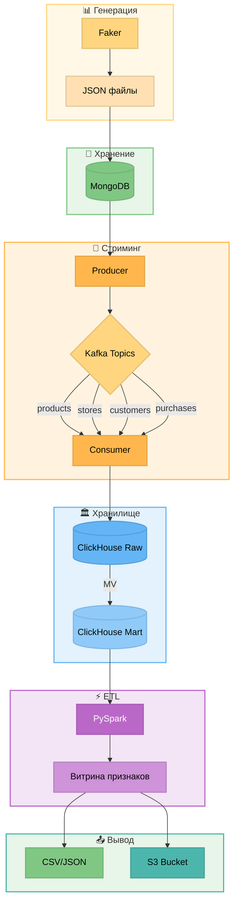
```mermaid
flowchart TB
    subgraph Gen["📊 Генерация"]
        A1[Faker] --> A2[JSON файлы]
    end

    subgraph Store["💾 Хранение"]
        A2 --> B1[(MongoDB)]
    end

    subgraph Stream["📡 Стриминг"]
        B1 --> C1[Producer]
        C1 --> C2{Kafka Topics}
        C2 -->|products| C3[Consumer]
        C2 -->|stores| C3
        C2 -->|customers| C3
        C2 -->|purchases| C3
    end

    subgraph Warehouse["🏛 Хранилище"]
        C3 --> D1[(ClickHouse Raw)]
        D1 -->|MV| D2[(ClickHouse Mart)]
    end

    subgraph ETL["⚡ ETL"]
        D2 --> E1[PySpark]
        E1 --> E2[Витрина признаков]
    end

    subgraph Output["📤 Вывод"]
        E2 --> F1[CSV/JSON]
        E2 --> F2[S3 Bucket]
    end

    %% Цветовая схема подграфов - пастельные тона
    style Gen fill:#fff8e6,stroke:#ffd580,stroke-width:2px
    style Store fill:#e8f5e9,stroke:#81c784,stroke-width:2px
    style Stream fill:#fff3e0,stroke:#ffb74d,stroke-width:2px
    style Warehouse fill:#e3f2fd,stroke:#64b5f6,stroke-width:2px
    style ETL fill:#f3e5f5,stroke:#ba68c8,stroke-width:2px
    style Output fill:#e8f5e9,stroke:#4db6ac,stroke-width:2px

    %% Цветовая схема компонентов - приглушённые пастельные тона
    style A1 fill:#ffd580,color:#000,stroke:#e6c073,stroke-width:2px
    style A2 fill:#ffe0b2,color:#000,stroke:#e6c79d,stroke-width:2px
    style B1 fill:#81c784,color:#000,stroke:#74b577,stroke-width:2px
    style C1 fill:#ffb74d,color:#000,stroke:#e6a545,stroke-width:2px
    style C2 fill:#ffd580,color:#000,stroke:#e6c073,stroke-width:2px
    style C3 fill:#ffb74d,color:#000,stroke:#e6a545,stroke-width:2px
    style D1 fill:#64b5f6,color:#000,stroke:#5a9fd6,stroke-width:2px
    style D2 fill:#90caf9,color:#000,stroke:#81b7e6,stroke-width:2px
    style E1 fill:#ba68c8,color:#fff,stroke:#a85cb8,stroke-width:2px
    style E2 fill:#ce93d8,color:#000,stroke:#b882c3,stroke-width:2px
    style F1 fill:#81c784,color:#000,stroke:#74b577,stroke-width:2px
    style F2 fill:#4db6ac,color:#000,stroke:#45a399,stroke-width:2px
```

### Компоненты системы 

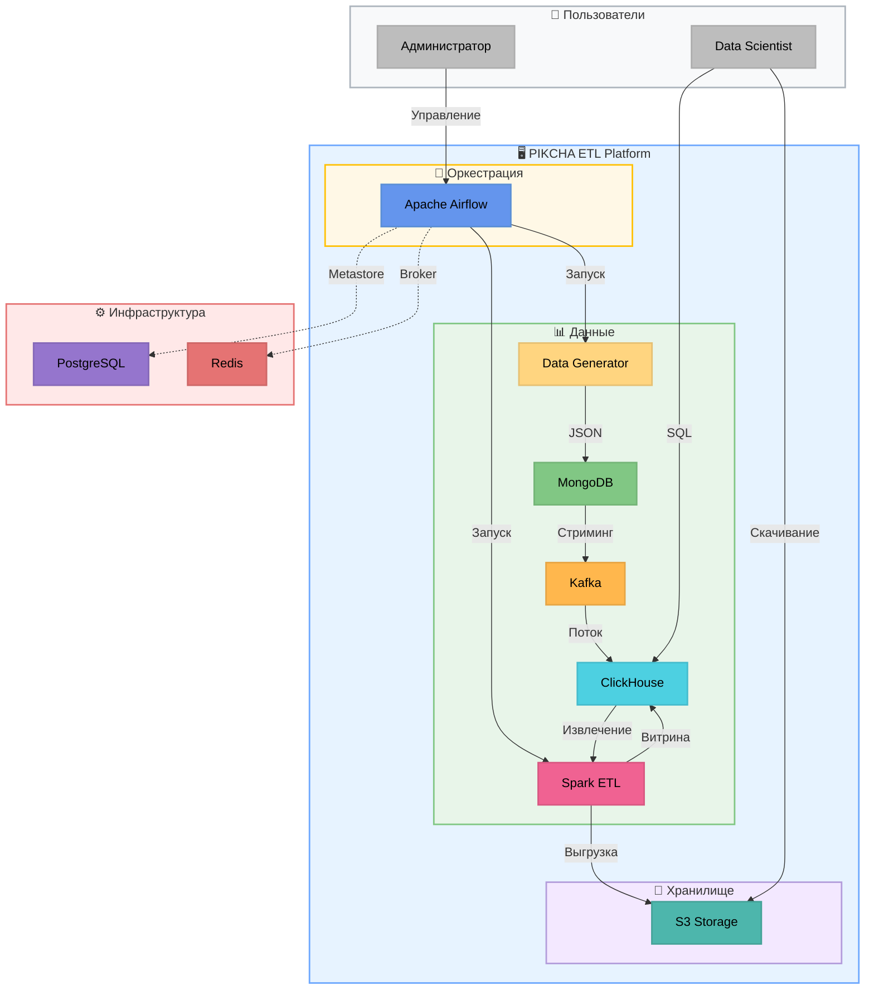
```mermaid
flowchart TB
    subgraph Users["👥 Пользователи"]
        DS[Data Scientist]
        AD[Администратор]
    end

    subgraph Platform["🖥️ PIKCHA ETL Platform"]
        subgraph Orchestration["🔄 Оркестрация"]
            AF[Apache Airflow]
        end

        subgraph Data["📊 Данные"]
            GN[Data Generator]
            MG[MongoDB]
            KF[Kafka]
            CH[ClickHouse]
            SP[Spark ETL]
        end

        subgraph Storage["💾 Хранилище"]
            S3[S3 Storage]
        end
    end

    subgraph Infrastructure["⚙️ Инфраструктура"]
        PG[PostgreSQL]
        RD[Redis]
    end

    AD -->|Управление| AF
    AF -->|Запуск| GN
    AF -->|Запуск| SP
    AF -.->|Metastore| PG
    AF -.->|Broker| RD

    GN -->|JSON| MG
    MG -->|Стриминг| KF
    KF -->|Поток| CH
    CH -->|Извлечение| SP
    SP -->|Витрина| CH
    SP -->|Выгрузка| S3

    DS -->|SQL| CH
    DS -->|Скачивание| S3

    %% Цветовая схема подграфов - пастельные тона
    style Users fill:#f8f9fa,stroke:#adb5bd,stroke-width:2px
    style Platform fill:#e7f3ff,stroke:#6ea8fe,stroke-width:2px
    style Orchestration fill:#fff8e6,stroke:#ffc107,stroke-width:2px
    style Data fill:#e8f5e9,stroke:#81c784,stroke-width:2px
    style Storage fill:#f3e8ff,stroke:#b39ddb,stroke-width:2px
    style Infrastructure fill:#ffe8e8,stroke:#e57373,stroke-width:2px

    %% Цветовая схема компонентов - приглушённые пастельные тона
    style AF fill:#6495ed,color:#000,stroke:#5a8fd6,stroke-width:2px
    style GN fill:#ffd580,color:#000,stroke:#e6c073,stroke-width:2px
    style MG fill:#81c784,color:#000,stroke:#74b577,stroke-width:2px
    style KF fill:#ffb74d,color:#000,stroke:#e6a545,stroke-width:2px
    style CH fill:#4dd0e1,color:#000,stroke:#45bccd,stroke-width:2px
    style SP fill:#f06292,color:#000,stroke:#d85882,stroke-width:2px
    style S3 fill:#4db6ac,color:#000,stroke:#45a399,stroke-width:2px
    style PG fill:#9575cd,color:#000,stroke:#8669b8,stroke-width:2px
    style RD fill:#e57373,color:#000,stroke:#ce6767,stroke-width:2px
    style DS fill:#bdbdbd,color:#000,stroke:#adadad,stroke-width:2px
    style AD fill:#bdbdbd,color:#000,stroke:#adadad,stroke-width:2px
```

### 🐳 Архитектура Docker

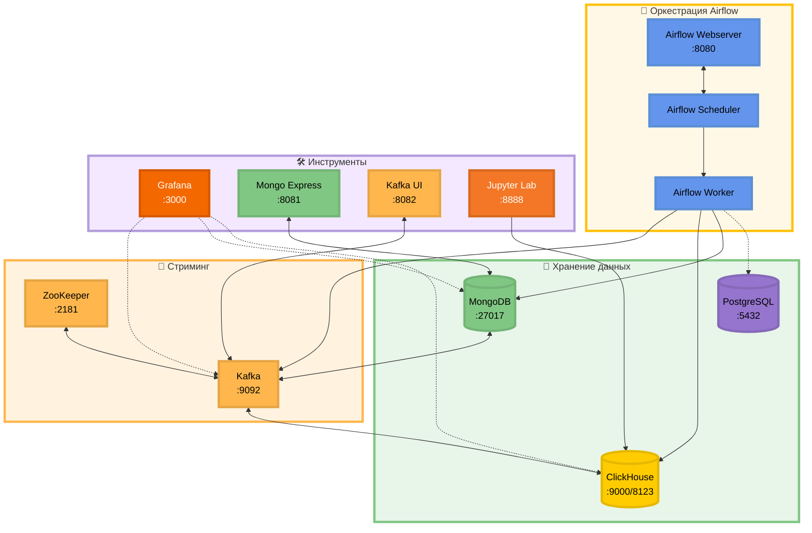
```mermaid
flowchart TB
    subgraph Orchestration["🔄 Оркестрация Airflow"]
        AFW[Airflow Webserver<br/>:8080]
        AFS[Airflow Scheduler]
        AFWK[Airflow Worker]
    end

    subgraph Data["💾 Хранение данных"]
        MG[(MongoDB<br/>:27017)]
        CH[(ClickHouse<br/>:9000/8123)]
        PG[(PostgreSQL<br/>:5432)]
    end

    subgraph Stream["📡 Стриминг"]
        ZK[ZooKeeper<br/>:2181]
        KF[Kafka<br/>:9092]
    end

    subgraph Tools["🛠️ Инструменты"]
        GF[Grafana<br/>:3000]
        ME[Mongo Express<br/>:8081]
        KU[Kafka UI<br/>:8082]
        JL[Jupyter Lab<br/>:8888]
    end

    AFW <--> AFS
    AFS --> AFWK
    AFWK -.-> PG

    AFWK --> MG
    AFWK --> CH
    AFWK --> KF

    MG <--> KF
    KF <--> CH

    ZK <--> KF

    GF -.-> CH
    GF -.-> MG
    GF -.-> KF

    ME <--> MG
    KU <--> KF

    JL --> CH

    %% Цветовая схема подграфов - пастельные тона
    style Orchestration fill:#fff8e6,stroke:#ffc107,stroke-width:4px
    style Data fill:#e8f5e9,stroke:#81c784,stroke-width:4px
    style Stream fill:#fff3e0,stroke:#ffb74d,stroke-width:4px
    style Tools fill:#f3e8ff,stroke:#b39ddb,stroke-width:4px

    %% Цветовая схема компонентов - приглушённые пастельные тона
    style AFW fill:#6495ed,color:#000,stroke:#5a8fd6,stroke-width:4px,font-size:16px
    style AFS fill:#6495ed,color:#000,stroke:#5a8fd6,stroke-width:4px,font-size:16px
    style AFWK fill:#6495ed,color:#000,stroke:#5a8fd6,stroke-width:4px,font-size:16px
    style MG fill:#81c784,color:#000,stroke:#74b577,stroke-width:4px,font-size:16px
    style CH fill:#FFCC01,color:#000,stroke:#e6b800,stroke-width:4px,font-size:16px
    style PG fill:#9575cd,color:#000,stroke:#8669b8,stroke-width:4px,font-size:16px
    style ZK fill:#ffb74d,color:#000,stroke:#e6a545,stroke-width:4px,font-size:16px
    style KF fill:#ffb74d,color:#000,stroke:#e6a545,stroke-width:4px,font-size:16px
    style GF fill:#f46800,color:#fff,stroke:#d85a00,stroke-width:4px,font-size:16px
    style ME fill:#81c784,color:#000,stroke:#74b577,stroke-width:4px,font-size:16px
    style KU fill:#ffb74d,color:#000,stroke:#e6a545,stroke-width:4px,font-size:16px
    style JL fill:#f37726,color:#fff,stroke:#d86a1f,stroke-width:4px,font-size:16px
```

**Описание компонентов:**

| Компонент | Порт | Назначение |
|-----------|------|------------|
| **airflow-webserver** | 8080 | Веб-интерфейс Apache Airflow |
| **airflow-scheduler** | — | Планировщик DAG-ов |
| **airflow-worker** | — | Выполнение задач (Celery) |
| **mongo** | 27017 | MongoDB для операционных данных |
| **clickhouse** | 9000/8123 | ClickHouse для аналитики |
| **postgres** | 5432 | Metastore для Airflow |
| **zookeeper** | 2181 | Координация Kafka |
| **kafka** | 9092/29092 | Брокер сообщений |
| **grafana** | 3000 | Визуализация и мониторинг |
| **mongo-express** | 8081 | Веб-UI для MongoDB |
| **kafka-ui** | 8082 | Веб-UI для Kafka |
| **jupyter** | 8888 | Jupyter Lab для аналитики |

### Последовательность выполнения (Sequence Diagram)

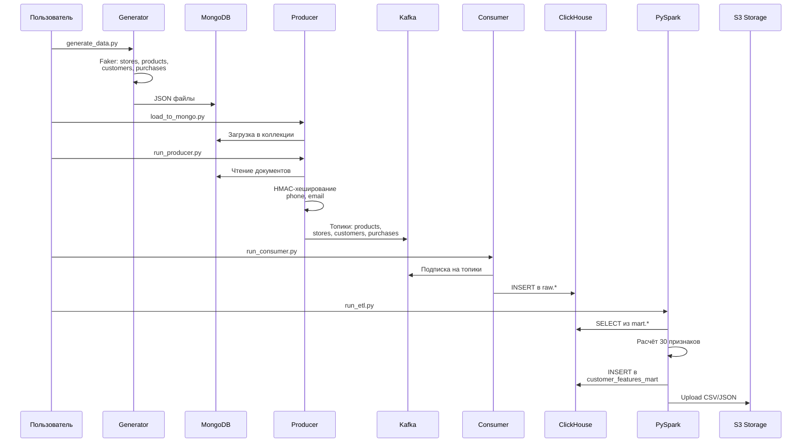
```mermaid
sequenceDiagram
    participant User as Пользователь
    participant Gen as Generator
    participant Mongo as MongoDB
    participant Prod as Producer
    participant Kafka as Kafka
    participant Cons as Consumer
    participant CH as ClickHouse
    participant Spark as PySpark
    participant S3 as S3 Storage
    
    User->>Gen: generate_data.py
    Gen->>Gen: Faker: stores, products,<br/>customers, purchases
    Gen->>Mongo: JSON файлы
    
    User->>Prod: load_to_mongo.py
    Prod->>Mongo: Загрузка в коллекции
    
    User->>Prod: run_producer.py
    Prod->>Mongo: Чтение документов
    Prod->>Prod: HMAC-хеширование<br/>phone, email
    Prod->>Kafka: Топики: products,<br/>stores, customers, purchases
    
    User->>Cons: run_consumer.py
    Cons->>Kafka: Подписка на топики
    Cons->>CH: INSERT в raw.*
    
    User->>Spark: run_etl.py
    Spark->>CH: SELECT из mart.*
    Spark->>Spark: Расчёт 30 признаков
    Spark->>CH: INSERT в<br/>customer_features_mart
    Spark->>S3: Upload CSV/JSON
```

---

## Архитектура оркестрации Airflow

### Компоненты Airflow

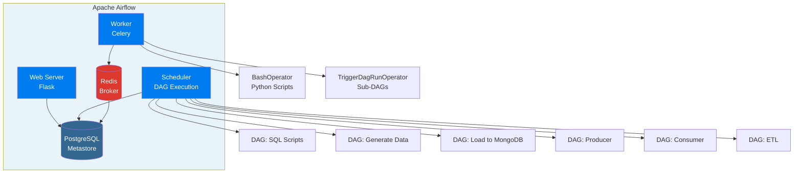
```mermaid
flowchart TB
    subgraph Airflow["Apache Airflow"]
        WS[Web Server<br/>Flask]
        SCH[Scheduler<br/>DAG Execution]
        WKR[Worker<br/>Celery]
        MET[(PostgreSQL<br/>Metastore)]
        BROKER[(Redis<br/>Broker)]
    end

    WS --> MET
    SCH --> MET
    WKR --> BROKER
    BROKER --> MET

    SCH --> DAG1[DAG: SQL Scripts]
    SCH --> DAG2[DAG: Generate Data]
    SCH --> DAG3[DAG: Load to MongoDB]
    SCH --> DAG4[DAG: Producer]
    SCH --> DAG5[DAG: Consumer]
    SCH --> DAG6[DAG: ETL]

    WKR --> TASK1[BashOperator<br/>Python Scripts]
    WKR --> TASK2[TriggerDagRunOperator<br/>Sub-DAGs]

    style Airflow fill:#e8f4f8
    style WS fill:#017cee,color:#fff
    style SCH fill:#017cee,color:#fff
    style WKR fill:#017cee,color:#fff
    style MET fill:#336791,color:#fff
    style BROKER fill:#dc382d,color:#fff
```

### Архитектура развёртывания

| Компонент | Назначение | Порт |
|-----------|------------|------|
| **Airflow Webserver** | Веб-интерфейс для управления DAG-ами | 8080 |
| **Airflow Scheduler** | Планировщик, запускает DAG-и по расписанию | 8974 (health) |
| **Airflow Worker** | Celery Worker, выполняет задачи | — |
| **PostgreSQL** | Airflow Metastore (хранение состояния DAG-ов, переменных, подключений) | 5432 |
| **Redis** | Broker для Celery (очередь задач) | 6379 |


### DAG-файлы

| DAG ID | Файл | Расписание | Описание |
|--------|------|------------|----------|
| `00_run_sql_scripts` | `run_sql_scripts_dag.py` | По требованию | Создание таблиц в ClickHouse |
| `01_generate_synthetic_data` | `generate_data_dag.py` | По требованию | Генерация данных |
| `02_load_data_to_mongodb` | `load_to_mongo_dag.py` | По требованию | Загрузка в MongoDB |
| `03_run_mongodb_kafka_producer` | `run_producer_dag.py` | По требованию | Producer (MongoDB → Kafka) |
| `04_run_kafka_clickhouse_consumer` | `run_consumer_dag.py` | По требованию | Consumer (Kafka → ClickHouse) |
| `05_run_customer_feature_etl` | `run_etl_dag.py` | По требованию | ETL витрины признаков |
| `etl_pipeline` | `etl_pipeline.py` | `0 10 * * *` (ежедневно в 10:00) | **Главный DAG** (оркестрация) |

### Главный пайплайн (etl_pipeline)

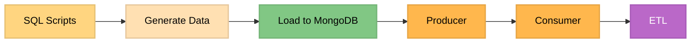
```mermaid
flowchart LR
    A[SQL Scripts] --> B[Generate Data]
    B --> C[Load to MongoDB]
    C --> D[Producer]
    D --> E[Consumer]
    E --> F[ETL]

    %% Цветовая схема - приглушённые пастельные тона
    style A fill:#ffd580,color:#000,stroke:#e6c073,stroke-width:2px
    style B fill:#ffe0b2,color:#000,stroke:#e6c79d,stroke-width:2px
    style C fill:#81c784,color:#000,stroke:#74b577,stroke-width:2px
    style D fill:#ffb74d,color:#000,stroke:#e6a545,stroke-width:2px
    style E fill:#ffb74d,color:#000,stroke:#e6a545,stroke-width:2px
    style F fill:#ba68c8,color:#fff,stroke:#a85cb8,stroke-width:2px
```

### Airflow Connections

Airflow использует следующие подключения (настраиваются при инициализации):

| Connection ID | Тип | Хост | Порт | Extra |
|---------------|-----|------|------|-------|
| `spark_default` | Spark | spark://spark | 7077 | — |
| `clickhouse_default` | ClickHouse | clickhouse | 9000 | Database: clickhouse |
| `mongodb_default` | MongoDB | mongo | 27017 | — |
| `kafka_default` | Generic | kafka | 29092 | `{"bootstrap.servers": "kafka:29092"}` |

### Sequence-диаграмма выполнения DAG-ов

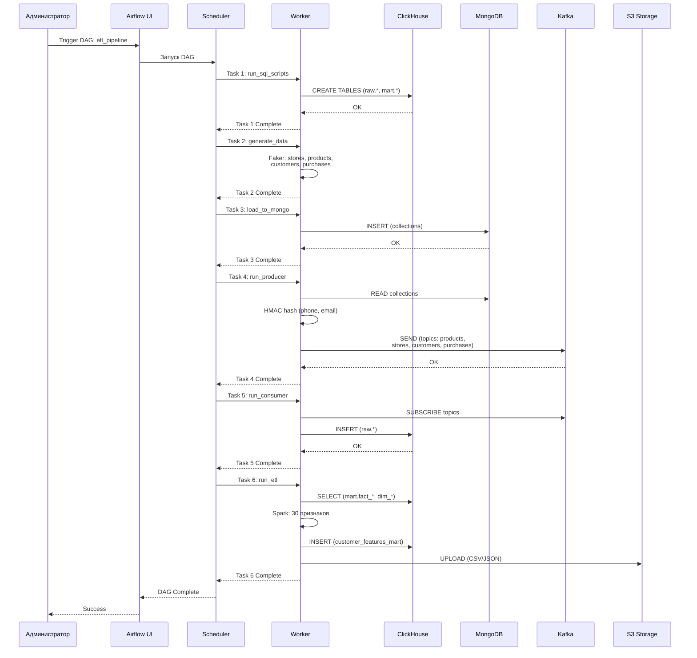
```mermaid
sequenceDiagram
    participant Admin as Администратор
    participant UI as Airflow UI
    participant SCH as Scheduler
    participant WKR as Worker
    participant DB as ClickHouse
    participant Mongo as MongoDB
    participant Kafka as Kafka
    participant S3 as S3 Storage

    Admin->>UI: Trigger DAG: etl_pipeline
    UI->>SCH: Запуск DAG

    SCH->>WKR: Task 1: run_sql_scripts
    WKR->>DB: CREATE TABLES (raw.*, mart.*)
    DB-->>WKR: OK
    WKR-->>SCH: Task 1 Complete

    SCH->>WKR: Task 2: generate_data
    WKR->>WKR: Faker: stores, products,<br/>customers, purchases
    WKR-->>SCH: Task 2 Complete

    SCH->>WKR: Task 3: load_to_mongo
    WKR->>Mongo: INSERT (collections)
    Mongo-->>WKR: OK
    WKR-->>SCH: Task 3 Complete

    SCH->>WKR: Task 4: run_producer
    WKR->>Mongo: READ collections
    WKR->>WKR: HMAC hash (phone, email)
    WKR->>Kafka: SEND (topics: products,<br/>stores, customers, purchases)
    Kafka-->>WKR: OK
    WKR-->>SCH: Task 4 Complete

    SCH->>WKR: Task 5: run_consumer
    WKR->>Kafka: SUBSCRIBE topics
    WKR->>DB: INSERT (raw.*)
    DB-->>WKR: OK
    WKR-->>SCH: Task 5 Complete

    SCH->>WKR: Task 6: run_etl
    WKR->>DB: SELECT (mart.fact_*, dim_*)
    WKR->>WKR: Spark: 30 признаков
    WKR->>DB: INSERT (customer_features_mart)
    WKR->>S3: UPLOAD (CSV/JSON)
    WKR-->>SCH: Task 6 Complete

    SCH-->>UI: DAG Complete
    UI-->>Admin: Success
```

---

## Структура проекта

```
pikcha_test_airflow/
├── airflow_config/                # Конфигурация Apache Airflow
│   └── webserver_config.py        # Настройки веб-сервера Airflow
│
├── config/                        # Конфигурация проекта
│   ├── __init__.py                # Экспорт настроек и логирования
│   ├── logging.py                 # Централизованное логирование
│   └── settings.py                # Dataclass-конфигурация
│
├── dags/                          # DAG-файлы Apache Airflow
│   ├── etl_pipeline.py            # Главный DAG оркестрации всего пайплайна
│   ├── generate_data_dag.py       # DAG генерации синтетических данных
│   ├── load_to_mongo_dag.py       # DAG загрузки данных в MongoDB
│   ├── run_producer_dag.py        # DAG Producer (MongoDB → Kafka)
│   ├── run_consumer_dag.py        # DAG Consumer (Kafka → ClickHouse)
│   ├── run_etl_dag.py             # DAG ETL витрины признаков
│   └── run_sql_scripts_dag.py     # DAG создания таблиц в ClickHouse
│
├── src/pikcha_etl/                # Основной ETL-модуль
│   ├── __init__.py
│   ├── types.py                   # Type aliases (JSONDict, StrPath)
│   ├── generation/                # Генерация синтетических данных
│   │   └── synthetic.py           # GroceryDataGenerator
│   ├── loader/                    # Загрузчики данных
│   │   └── mongo_loader.py        # MongoDataLoader
│   ├── pipeline/                  # Kafka пайплайны
│   │   ├── mongo_kafka_producer.py      # Producer: MongoDB → Kafka
│   │   └── kafka_clickhouse_consumer.py # Consumer: Kafka → ClickHouse
│   ├── etl/                       # Batch ETL процессы
│   │   ├── process.py             # CustomerFeatureETL (Spark)
│   │   ├── config.py              # ETL конфигурация
│   │   └── upload_to_s3.py        # Выгрузка в S3
│   └── utils/                     # Утилиты
│       ├── helpers.py             # Нормализация телефона/email
│       └── hashing.py             # HMAC-SHA256 хеширование
│
├── scripts/                       # CLI-скрипты запуска
│   ├── generate_data.py           # Генерация данных
│   ├── load_to_mongo.py           # Загрузка в MongoDB
│   ├── run_producer.py            # Producer (MongoDB → Kafka)
│   ├── run_consumer.py            # Consumer (Kafka → ClickHouse)
│   ├── run_etl.py                 # ETL витрины признаков
│   ├── cleanup_all.py             # Полная очистка данных (data/, MongoDB, Kafka, ClickHouse)
│   ├── dedup_mart.py              # Дедупликация таблиц mart-слоя (OPTIMIZE FINAL)
│   └── clickhouse-jdbc-0.4.6.jar  # JDBC драйвер для Spark
│
├── sql/                           # SQL-скрипты ClickHouse
│   ├── 00_create_raw_tables.sql       # Raw слой
│   ├── 01_create_mart_database.sql    # Mart слой + измерения/факты
│   ├── 02_create_materialized_views.sql # MV для автоматической загрузки
│   └── 03_create_customer_features_table.sql # Витрина признаков
│
├── ui/                            # UI компоненты
│   └── UI.html                    # HTML-файл интерфейса
│
├── grafana/                       # Конфигурация Grafana
│   ├── dashboards/                # JSON-файлы дашбордов
│   │   ├── customer_features_matrix.json    # Матрица признаков клиентов
│   │   ├── mart_duplicates_analysis.json    # Анализ дубликатов mart-слоя
│   │   ├── raw_duplicates_analysis.json     # Анализ дубликатов raw-слоя
│   │   ├── raw_layer_stats.json             # Статистика raw-слоя
│   │   └── stores_geo_map.json              # Гео-карта магазинов
│   ├── alerting/                  # Правила алертинга
│   │   ├── alert-rules.yml        # Правила и условия алертов
│   │   └── contact-points.yml     # Контактные точки (Telegram)
│   ├── datasources/               # Источники данных
│   │   └── clickhouse.yml         # Подключение к ClickHouse
│   └── provisioning/              # Провижининг конфигурации
│       └── dashboards.yml         # Настройка загрузки дашбордов
│
├── data/                          # Сгенерированные JSON данные
├── output/                        # Результаты ETL (CSV/JSON)
├── logs/                          # Логи выполнения
├── docs/                          # Документация
│   └── architecture.md            # Подробная архитектура системы
│
├── docker-compose.yml             # Инфраструктура контейнеров
├── Dockerfile.airflow             # Dockerfile для Airflow
├── Dockerfile.jupyter             # Dockerfile для Jupyter
├── requirements.txt               # Python зависимости
├── .env.example                   # Пример конфигурации
├── .gitignore                     # Git ignore файл
└── README.md                      # Этот файл
```

### Зависимости между модулями

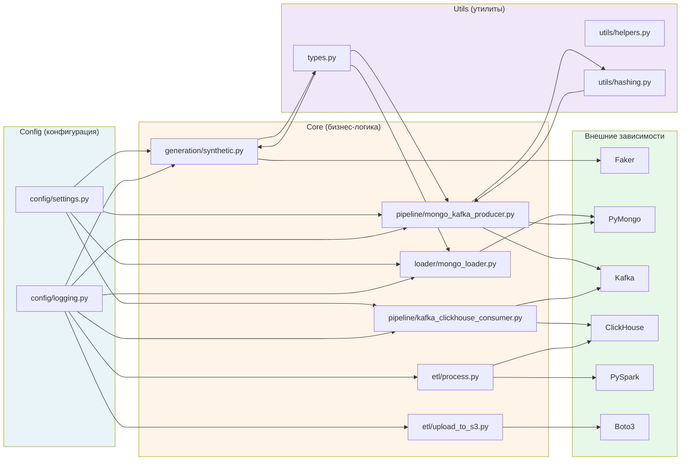
```mermaid
graph LR
    subgraph Config["Config (конфигурация)"]
        C1[config/settings.py]
        C2[config/logging.py]
    end

    subgraph Core["Core (бизнес-логика)"]
        G1[generation/synthetic.py]
        L1[loader/mongo_loader.py]
        P1[pipeline/mongo_kafka_producer.py]
        C3[pipeline/kafka_clickhouse_consumer.py]
        E1[etl/process.py]
        S1[etl/upload_to_s3.py]
    end

    subgraph Utils["Utils (утилиты)"]
        U1[utils/helpers.py]
        U2[utils/hashing.py]
        T1[types.py]
    end

    subgraph External["Внешние зависимости"]
        EXT1[Faker]
        EXT2[PyMongo]
        EXT3[Kafka]
        EXT4[ClickHouse]
        EXT5[PySpark]
        EXT6[Boto3]
    end

    %% Config зависимости
    C1 --> G1
    C1 --> L1
    C1 --> P1
    C1 --> C3
    C2 --> G1
    C2 --> L1
    C2 --> P1
    C2 --> C3
    C2 --> E1
    C2 --> S1

    %% Utils зависимости
    U2 --> P1
    T1 --> G1
    T1 --> L1
    T1 --> P1

    %% Core зависимости
    P1 --> U2

    %% Внешние зависимости
    G1 --> EXT1
    G1 --> T1
    L1 --> EXT2
    P1 --> EXT2
    P1 --> EXT3
    C3 --> EXT3
    C3 --> EXT4
    E1 --> EXT5
    E1 --> EXT4
    S1 --> EXT6

    style Config fill:#e8f4f8
    style Core fill:#fff4e8
    style Utils fill:#f0e8f8
    style External fill:#e8f8e8
```

**Описание зависимостей:**

| Модуль | Зависит от | Описание |
|--------|------------|----------|
| `generation/synthetic.py` | `config`, `types`, `Faker` | Генерация синтетических данных |
| `loader/mongo_loader.py` | `config`, `types`, `PyMongo` | Загрузка JSON в MongoDB |
| `pipeline/mongo_kafka_producer.py` | `config`, `types`, `hashing`, `PyMongo`, `Kafka` | Producer: MongoDB → Kafka |
| `pipeline/kafka_clickhouse_consumer.py` | `config`, `Kafka`, `ClickHouse` | Consumer: Kafka → ClickHouse |
| `etl/process.py` | `etl/config`, `PySpark`, `ClickHouse` | ETL витрины признаков |
| `etl/upload_to_s3.py` | `etl/config`, `Boto3` | Выгрузка результатов в S3 |
| `utils/hashing.py` | — | HMAC-SHA256 хеширование |
| `types.py` | — | Type aliases (JSONDict, JSONList) |

---

## Конфигурация

### Переменные окружения

| Группа | Переменная | По умолчанию | Описание | Модуль |
|--------|------------|--------------|----------|--------|
| **MongoDB** | | | | |
| | `MONGO_URI` | `mongodb://localhost:27017` | URI подключения | `loader`, `producer` |
| | `MONGO_DATABASE` | `mongo_db` | Имя базы данных | `loader`, `producer` |
| **ClickHouse** | | | | |
| | `CLICKHOUSE_HOST` | `localhost` | Хост сервера | `consumer`, `etl` |
| | `CLICKHOUSE_HTTP_PORT` | `8123` | HTTP порт | `etl` (JDBC) |
| | `CLICKHOUSE_NATIVE_PORT` | `9000` | Native порт | `consumer` |
| | `CLICKHOUSE_DATABASE` | `mart` | База витрин | `etl` |
| | `CLICKHOUSE_RAW_DB` | `raw` | База сырых данных | `consumer` |
| | `CLICKHOUSE_USER` | `clickhouse` | Пользователь | `consumer`, `etl` |
| | `CLICKHOUSE_PASSWORD` | `clickhouse` | Пароль | `consumer`, `etl` |
| **Kafka** | | | | |
| | `KAFKA_BROKER` | `localhost:9092` | Адрес брокера | `producer`, `consumer` |
| | `KAFKA_GROUP` | `pikcha-consumer-group` | Consumer group | `consumer` |
| | `KAFKA_TOPICS` | `products,stores,customers,purchases` | Топики | `producer`, `consumer` |
| **Безопасность** | | | | |
| | `HMAC_SECRET_KEY` | — | Секретный ключ HMAC | `producer` |
| **S3** | | | | |
| | `S3_ENABLED` | `true` | Включить S3 | `upload_to_s3` |
| | `S3_ENDPOINT` | `https://s3.ru-7.storage.selcloud.ru` | Endpoint | `upload_to_s3` |
| | `S3_BUCKET` | `de-internship-pikcha` | Имя бакета | `upload_to_s3` |
| | `S3_ACCESS_KEY` | — | Access key | `upload_to_s3` |
| | `S3_SECRET_KEY` | — | Secret key | `upload_to_s3` |
| | `S3_REGION` | `ru-7` | Регион | `upload_to_s3` |
| **Вывод** | | | | |
| | `OUTPUT_DIR` | `output` | Директория результатов | `etl` |
| | `CSV_FILENAME_PREFIX` | `analytic_result` | Префикс файлов | `etl` |
| | `DATA_DIR` | `data` | Директория данных | `generation`, `loader` |

### Dataclass-конфигурация

**`config/settings.py`:**
```python
@dataclass
class Settings:
    mongodb: MongoDBSettings
    clickhouse: ClickHouseSettings
    kafka: KafkaSettings
    s3: S3Settings
    security: SecuritySettings
    output: OutputSettings
```

**`src/pikcha_etl/etl/config.py`:**
```python
@dataclass
class FeatureConfig:
    # Временные окна
    window_7d: int = 7
    window_14d: int = 14
    window_30d: int = 30
    window_90d: int = 90
    
    # Пороги
    min_purchases_recurrent: int = 2
    high_cart_threshold: float = 1000.0
    payment_threshold: float = 0.7
```

---

## Генерация данных

### Модуль: `src/pikcha_etl/generation/synthetic.py`

**Класс:** `GroceryDataGenerator`

**Ответственность:** Создание реалистичных синтетических данных продуктового ритейла.

### Генерируемые сущности

| Сущность | Файл | Количество (по умолчанию) | Настраивается | Поля |
|----------|------|---------------------------|---------------|------|
| **Stores** | `stores/store-XXX.json` | **45** (30 + 15) | ✅ `num_stores` | `store_id`, `store_name`, `store_network`, `location`, `manager`, `hours` |
| **Products** | `products/prd-XXXX.json` | **50** (по 10 из категории) | ✅ `num_products` | `id`, `name`, `group`, `kbju`, `price`, `manufacturer` |
| **Customers** | `customers/cus-XXXX.json` | **45** (= магазинам) | ✅ `num_customers` | `customer_id`, `name`, `email`, `phone`, `preferences` |
| **Purchases** | `purchases/purchases_*.json` | **200** | ✅ `num_purchases` | `purchase_id`, `customer`, `store`, `items[]`, `total` |

### Гибкая настройка количества

**Через CLI:**
```bash
# Генерация с кастомным количеством объектов
python scripts/generate_data.py \
    --num-stores 100 \
    --num-products 200 \
    --num-customers 500 \
    --num-purchases 1000
```

**Через Python API:**
```python
from src.pikcha_etl.generation.synthetic import GroceryDataGenerator

generator = GroceryDataGenerator()
result = generator.run(
    num_stores=100,        # 100 магазинов (50 + 50 по сетям)
    num_products=200,      # 200 товаров (по 40 из категории)
    num_customers=500,     # 500 покупателей (циклически к магазинам)
    num_purchases=1000     # 1000 покупок
)
print(result)
# {'stores': 100, 'products': 200, 'customers': 500, 'purchases': 1000}
```

**Логика распределения:**
- **Магазины:** распределяются поровну между сетями ("Большая Пикча" / "Маленькая Пикча")
- **Товары:** распределяются по категориям (5 категорий)
- **Покупатели:** если больше чем магазинов, привязываются циклически
- **Покупки:** генерируются на основе выбранных покупателей, магазинов и товаров

### Пример JSON: магазин

```json
{
  "store_id": "store-001",
  "store_name": "Большая Пикча #1",
  "store_network": "Большая Пикча",
  "store_type_description": "Супермаркет у дома",
  "type": "offline",
  "categories": "🥖 Зерновые,🥛 Молочные,🍏 Фрукты",
  "manager_name": "Иванов Иван Иванович",
  "manager_phone": "+7 (999) 123-45-67",
  "manager_email": "ivanov@bigpikcha.ru",
  "location": {
    "country": "Россия",
    "city": "Москва",
    "street": "ул. Ленина",
    "house": "15",
    "postal_code": "101000",
    "coordinates": {
      "latitude": "55.7558",
      "longitude": "37.6176"
    }
  },
  "opening_hours": {
    "mon_fri": "08:00-22:00",
    "sat": "09:00-21:00",
    "sun": "10:00-20:00"
  },
  "flags": {
    "accepts_online_orders": true,
    "delivery_available": true,
    "warehouse_connected": true
  }
}
```

### Пример JSON: покупка

```json
{
  "purchase_id": "ord-00001",
  "customer": {
    "customer_id": "cus-001",
    "first_name": "Анна",
    "last_name": "Петрова",
    "email": "anna.petrova@example.ru",
    "phone": "+7 (916) 234-56-78",
    "is_loyalty_member": true,
    "loyalty_card_number": "LC-001234"
  },
  "store": {
    "store_id": "store-001",
    "store_name": "Большая Пикча #1",
    "location": {
      "city": "Москва",
      "street": "ул. Ленина",
      "house": "15"
    }
  },
  "items": [
    {
      "product_id": "prd-001",
      "name": "Молоко 3,2%",
      "category": "🥛 Молочные продукты",
      "quantity": 2,
      "unit": "шт",
      "price_per_unit": 75.00,
      "total_price": 150.00,
      "kbju": {
        "calories": 60,
        "protein": 3.0,
        "fat": 3.2,
        "carbohydrates": 4.7
      },
      "manufacturer": {
        "name": "Вимм-Билль-Данн",
        "country": "Россия",
        "inn": "7701234567"
      }
    }
  ],
  "total_amount": 150.00,
  "payment_method": "card",
  "is_delivery": false,
  "purchase_datetime": "2026-02-25T14:30:00"
}
```

### Структура каталога `data/`

```
data/
├── stores/
│   └── stores_20260225_143000.json
├── products/
│   └── products_20260225_143000.json
├── customers/
│   └── customers_20260225_143000.json
└── purchases/
    └── purchases_20260225_143000.json
```

---

## Загрузка в MongoDB

### Модуль: `src/pikcha_etl/loader/mongo_loader.py`

**Класс:** `MongoDataLoader`

**Ответственность:** Загрузка JSON-файлов в коллекции MongoDB.

### Маппинг файлов в коллекции

| Файл | Коллекция | Индексы |
|------|-----------|---------|
| `stores/*.json` | `stores` | `store_id` (unique) |
| `products/*.json` | `products` | `id` (unique) |
| `customers/*.json` | `customers` | `customer_id` (unique) |
| `purchases/*.json` | `purchases` | `purchase_id` (unique) |

### Алгоритм загрузки

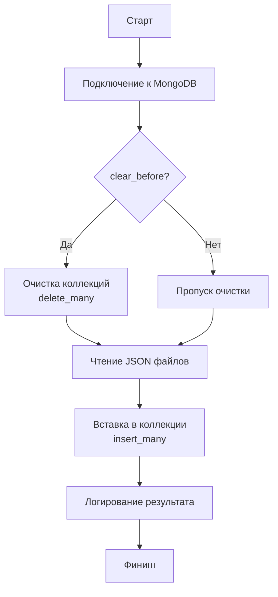
```mermaid
flowchart TD
    A[Старт] --> B[Подключение к MongoDB]
    B --> C{clear_before?}
    C -->|Да| D[Очистка коллекций<br/>delete_many]
    C -->|Нет| E[Пропуск очистки]
    D --> F[Чтение JSON файлов]
    E --> F
    F --> G[Вставка в коллекции<br/>insert_many]
    G --> H[Логирование результата]
    H --> I[Финиш]
```

---

## Стриминговый пайплайн

### Producer: MongoDB → Kafka

**Модуль:** `src/pikcha_etl/pipeline/mongo_kafka_producer.py`  
**Класс:** `MongoKafkaProducer`

#### Топики Kafka

| Топик | Источник | Партиции | Retention |
|-------|----------|----------|-----------|
| `products` | `products` collection | 1 | 7 дней |
| `stores` | `stores` collection | 1 | 7 дней |
| `customers` | `customers` collection | 1 | 7 дней |
| `purchases` | `purchases` collection | 1 | 7 дней |

#### Формат сообщения Kafka

```json
{
  "json_data": "{\"store_id\": \"store-001\", ...}",
  "event_time": "2026-02-25T14:30:00.123456Z"
}
```

#### Безопасность: HMAC-хеширование

**Какие поля хешируются:**

```python
SENSITIVE_FIELDS = {
    'customers': ['phone', 'email'],
    'purchases': ['customer.phone', 'customer.email']
}
```

**Алгоритм:**
```python
def generate_hmac_hash(value: Any, secret_key: str) -> str:
    data = str(value).encode("utf-8")
    key = secret_key.encode("utf-8")
    return hmac.new(key, data, hashlib.sha256).hexdigest()
```

**Пример:**
```
До нормализации:  "+7 (999) 123-45-67"
После нормализации: "+79991234567"
После HMAC-SHA256:  "a3f2b8c1d4e5f6789012345678901234..."
```

#### Sequence: Producer

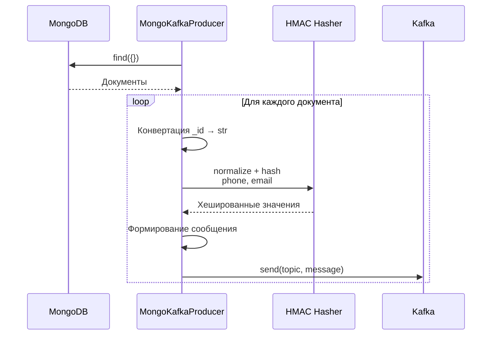
```mermaid
sequenceDiagram
    participant Mongo as MongoDB
    participant Prod as MongoKafkaProducer
    participant Hash as HMAC Hasher
    participant Kafka as Kafka
    
    Prod->>Mongo: find({})
    Mongo-->>Prod: Документы
    
    loop Для каждого документа
        Prod->>Prod: Конвертация _id → str
        Prod->>Hash: normalize + hash<br/>phone, email
        Hash-->>Prod: Хешированные значения
        Prod->>Prod: Формирование сообщения
        Prod->>Kafka: send(topic, message)
    end
```

---

### Consumer: Kafka → ClickHouse

**Модуль:** `src/pikcha_etl/pipeline/kafka_clickhouse_consumer.py`  
**Класс:** `KafkaClickHouseConsumer`

#### Raw-слой: структура таблиц

**`raw.stores`** (22 поля):
```sql
CREATE TABLE raw.stores (
    json_data String,
    event_time DateTime64(9),
    store_id String,
    store_name String,
    store_network String,
    location_country String,
    location_city String,
    location_street String,
    location_house String,
    location_postal_code String,
    location_coordinates_latitude String,
    location_coordinates_longitude String,
    -- ... остальные поля
) ENGINE = MergeTree()
PARTITION BY toYYYYMM(event_time)
ORDER BY event_time
TTL event_time + INTERVAL 180 DAY;
```

**`raw.purchases`** (35+ полей с Nested):
```sql
CREATE TABLE raw.purchases (
    json_data String,
    event_time DateTime64(9),
    purchase_id String,
    
    -- Денормализованные данные клиента
    customer_customer_id String,
    customer_first_name String,
    customer_email String,
    
    -- Денормализованные данные магазина
    store_store_id String,
    store_store_name String,
    store_location_city String,
    
    -- Nested-структура для позиций
    items Nested (
        product_id String,
        name String,
        category String,
        quantity String,
        price_per_unit String,
        total_price String,
        kbju_calories String,
        kbju_protein String,
        kbju_fat String,
        kbju_carbohydrates String
    ),
    
    total_amount String,
    payment_method String,
    purchase_datetime String
) ENGINE = MergeTree()
PARTITION BY toYYYYMM(event_time)
ORDER BY event_time;
```

#### Маппинг полей JSON → ClickHouse

| JSON путь | Поле ClickHouse | Тип |
|-----------|-----------------|-----|
| `store_id` | `store_id` | String |
| `location.city` | `location_city` | String |
| `items[].product_id` | `items.product_id` | Nested Array |
| `customer.phone` | `customer_phone` | String (hashed) |

#### Sequence: Consumer

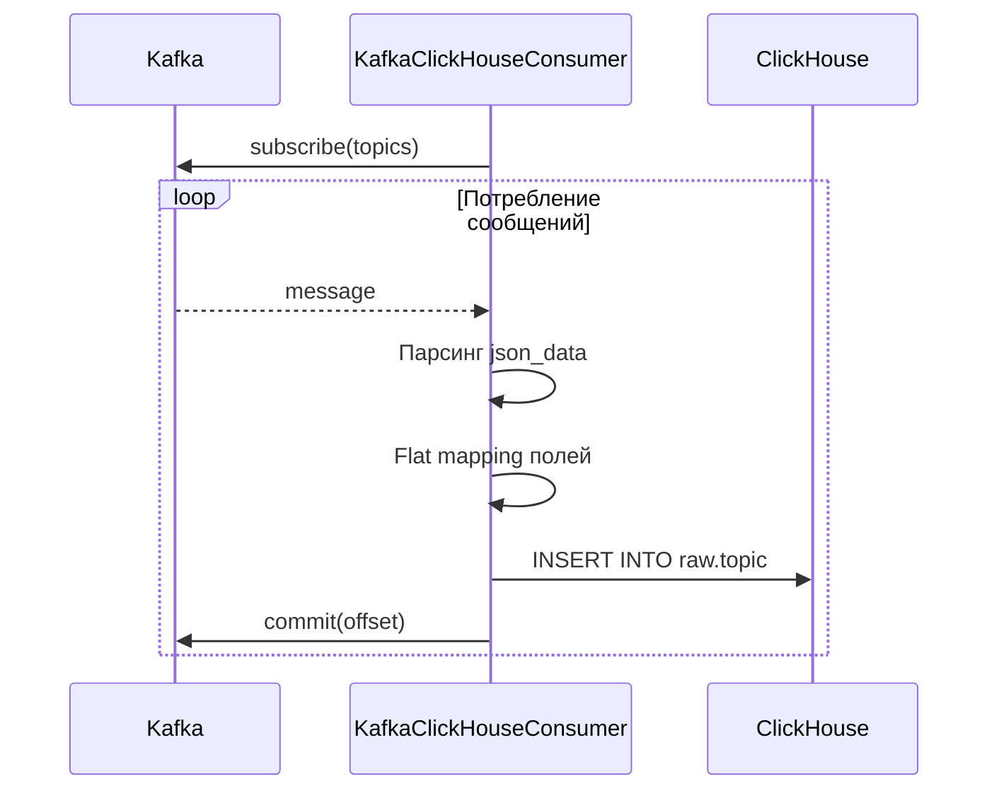
```mermaid
sequenceDiagram
    participant Kafka as Kafka
    participant Cons as KafkaClickHouseConsumer
    participant CH as ClickHouse
    
    Cons->>Kafka: subscribe(topics)
    
    loop Потребление сообщений
        Kafka-->>Cons: message
        Cons->>Cons: Парсинг json_data
        Cons->>Cons: Flat mapping полей
        Cons->>CH: INSERT INTO raw.topic
        Cons->>Kafka: commit(offset)
    end
```

---

## Хранилище данных ClickHouse

### Архитектура слоёв

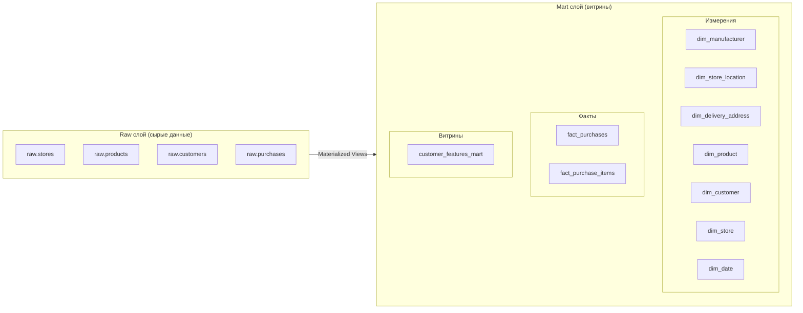
```mermaid
graph LR
    subgraph Raw["Raw слой (сырые данные)"]
        R1[raw.stores]
        R2[raw.products]
        R3[raw.customers]
        R4[raw.purchases]
    end
    
    subgraph Mart["Mart слой (витрины)"]
        subgraph Dim["Измерения"]
            D1[dim_manufacturer]
            D2[dim_store_location]
            D3[dim_delivery_address]
            D4[dim_product]
            D5[dim_customer]
            D6[dim_store]
            D7[dim_date]
        end
        
        subgraph Fact["Факты"]
            F1[fact_purchases]
            F2[fact_purchase_items]
        end
        
        subgraph Views["Витрины"]
            V1[customer_features_mart]
        end
    end
    
    Raw -->|Materialized Views| Mart
```

### Mart слой: схема данных (ER-диаграмма)

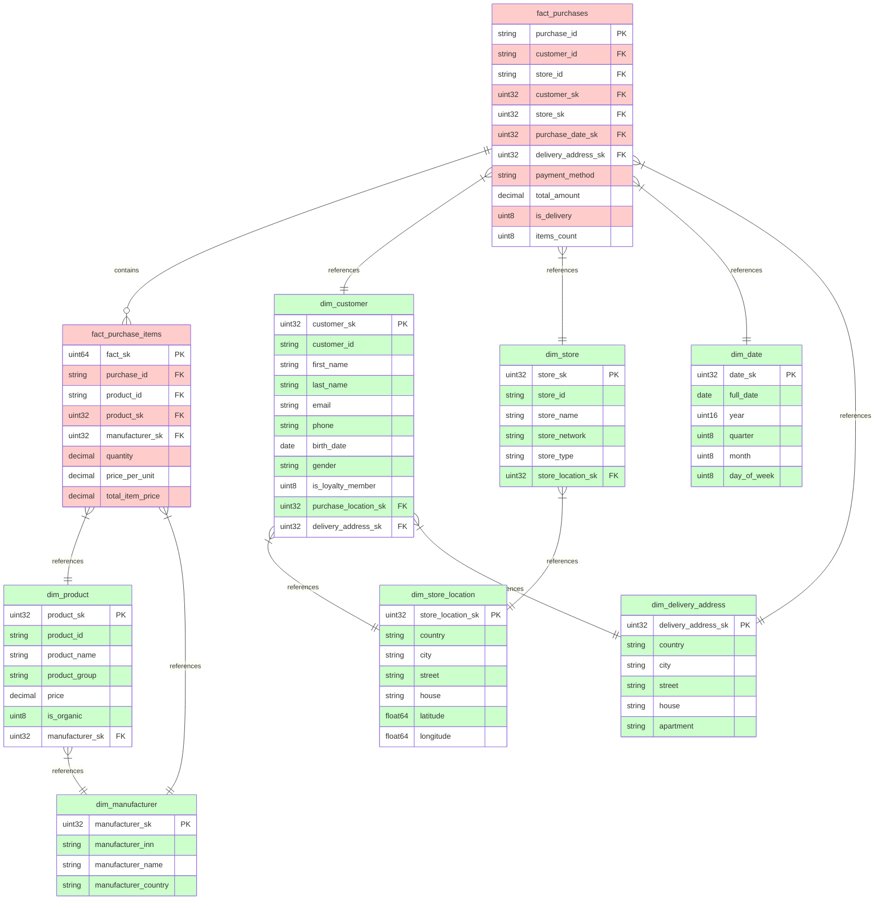
```mermaid
erDiagram
    fact_purchases {
        string purchase_id PK
        string customer_id FK
        string store_id FK
        uint32 customer_sk FK
        uint32 store_sk FK
        uint32 purchase_date_sk FK
        uint32 delivery_address_sk FK
        string payment_method
        decimal total_amount
        uint8 is_delivery
        uint8 items_count
    }
    
    fact_purchase_items {
        uint64 fact_sk PK
        string purchase_id FK
        string product_id FK
        uint32 product_sk FK
        uint32 manufacturer_sk FK
        decimal quantity
        decimal price_per_unit
        decimal total_item_price
    }
    
    dim_customer {
        uint32 customer_sk PK
        string customer_id
        string first_name
        string last_name
        string email
        string phone
        date birth_date
        string gender
        uint8 is_loyalty_member
        uint32 purchase_location_sk FK
        uint32 delivery_address_sk FK
    }
    
    dim_store {
        uint32 store_sk PK
        string store_id
        string store_name
        string store_network
        string store_type
        uint32 store_location_sk FK
    }
    
    dim_product {
        uint32 product_sk PK
        string product_id
        string product_name
        string product_group
        decimal price
        uint8 is_organic
        uint32 manufacturer_sk FK
    }
    
    dim_manufacturer {
        uint32 manufacturer_sk PK
        string manufacturer_inn
        string manufacturer_name
        string manufacturer_country
    }
    
    dim_store_location {
        uint32 store_location_sk PK
        string country
        string city
        string street
        string house
        float64 latitude
        float64 longitude
    }
    
    dim_delivery_address {
        uint32 delivery_address_sk PK
        string country
        string city
        string street
        string house
        string apartment
    }
    
    dim_date {
        uint32 date_sk PK
        date full_date
        uint16 year
        uint8 quarter
        uint8 month
        uint8 day_of_week
    }
    

    
    fact_purchases ||--o{ fact_purchase_items : contains
    fact_purchases }|--|| dim_customer : references
    fact_purchases }|--|| dim_store : references
    fact_purchases }|--|| dim_date : references
    fact_purchases }|--|| dim_delivery_address : references
    fact_purchase_items }|--|| dim_product : references
    fact_purchase_items }|--|| dim_manufacturer : references
    dim_customer }|--|| dim_store_location : references
    dim_customer }|--|| dim_delivery_address : references
    dim_store }|--|| dim_store_location : references
    dim_product }|--|| dim_manufacturer : references
    
    style fact_purchases fill:#ffcccc
    style fact_purchase_items fill:#ffcccc
    style dim_customer fill:#ccffcc
    style dim_store fill:#ccffcc
    style dim_product fill:#ccffcc
    style dim_manufacturer fill:#ccffcc
    style dim_store_location fill:#ccffcc
    style dim_delivery_address fill:#ccffcc
    style dim_date fill:#ccffcc
    style customer_features_mart fill:#ccccff
```

### Измерения (Dimensions)

| Таблица | Ключ | Атрибуты | Движок |
|---------|------|----------|--------|
| **`dim_manufacturer`** | `manufacturer_sk` | ИНН, название, страна, сайт | ReplacingMergeTree |
| **`dim_store_location`** | `store_location_sk` | Страна, город, улица, координаты | ReplacingMergeTree |
| **`dim_delivery_address`** | `delivery_address_sk` | Страна, город, улица, квартира | ReplacingMergeTree |
| **`dim_product`** | `product_sk` | Название, группа, КБЖУ, цена, organic | ReplacingMergeTree |
| **`dim_customer`** | `customer_sk` | ФИО, email, телефон, лояльность | ReplacingMergeTree |
| **`dim_store`** | `store_sk` | Название, сеть, тип, часы работы | ReplacingMergeTree |
| **`dim_date`** | `date_sk` | Дата, год, квартал, месяц, день | MergeTree |

### Факты (Fact Tables)

| Таблица | Ключ | Метрики | Связи |
|---------|------|---------|-------|
| **`fact_purchases`** | `purchase_id` | `total_amount`, `items_count` | → dim_customer, dim_store, dim_date |
| **`fact_purchase_items`** | `fact_sk` | `quantity`, `price_per_unit` | → dim_product, dim_manufacturer |

### Materialized Views

**Назначение:** Автоматическая загрузка данных из Raw в Mart при INSERT.

| MV | Источник | Цель | Триггер |
|----|----------|------|---------|
| `mv_dim_manufacturer_from_products` | `raw.products` | `dim_manufacturer` | INSERT в raw.products |
| `mv_dim_store_location_from_stores` | `raw.stores` | `dim_store_location` | INSERT в raw.stores |
| `mv_dim_delivery_address_from_customers` | `raw.customers` | `dim_delivery_address` | INSERT в raw.customers |
| `mv_dim_product` | `raw.products` | `dim_product` | INSERT в raw.products |
| `mv_dim_customer` | `raw.customers` | `dim_customer` | INSERT в raw.customers |
| `mv_dim_store` | `raw.stores` | `dim_store` | INSERT в raw.stores |
| `mv_dim_date` | `raw.purchases` | `dim_date` | INSERT в raw.purchases |
| `mv_fact_purchases` | `raw.purchases` | `fact_purchases` | INSERT в raw.purchases |
| `mv_fact_purchase_items` | `raw.purchases` | `fact_purchase_items` | INSERT в raw.purchases |

### Витрина признаков клиентов

Таблица `mart.customer_features_mart` содержит **30 бинарных признаков** для ML-кластеризации:

| Категория | Признак | Описание |
|-----------|---------|----------|
| **product_preference** | `bought_milk_last_30d` | Покупал молочные продукты за 30 дней |
| | `bought_fruits_last_14d` | Покупал фрукты/ягоды за 14 дней |
| | `not_bought_veggies_14d` | Не покупал овощи/зелень за 14 дня |
| | `organic_preference` | Купил органический продукт |
| | `buys_bakery` | Покупал хлеб/выпечку |
| | `bought_meat_last_week` | Покупал мясо/рыбу/яйца за 7 дней |
| | `fruit_lover` | ≥3 покупок фруктов за 30 дней |
| | `vegetarian_profile` | Нет мясных продуктов за 90 дней |
| **purchase_behavior** | `recurrent_buyer` | >2 покупок за 30 дней |
| | `inactive_14_30` | Не покупал 14-30 дней |
| | `delivery_user` | Пользовался доставкой |
| | `no_purchases` | Нет покупок (только регистрация) |
| **loyalty** | `new_customer` | Зарегистрировался <30 дней назад |
| | `loyal_customer` | Карта лояльности + ≥3 покупки |
| **spending** | `bulk_buyer` | Средняя корзина >1000₽ |
| | `low_cost_buyer` | Средняя корзина <200₽ |
| | `recent_high_spender` | >2000₽ за последние 7 дней |
| **temporal** | `night_shopper` | Покупки после 20:00 |
| | `morning_shopper` | Покупки до 10:00 |
| | `weekend_shopper` | ≥60% покупок в выходные |
| | `weekday_shopper` | ≥60% покупок в будни |
| | `early_bird` | Покупки 12:00-15:00 |
| **payment** | `prefers_cash` | ≥70% оплат наличными |
| | `prefers_card` | ≥70% оплат картой |
| **location** | `multicity_buyer` | Покупки в разных городах |
| | `store_loyal` | Один магазин |
| | `switching_store` | Разные магазины |
| **basket** | `single_item_buyer` | ≥50% покупок — 1 товар |
| | `varied_shopper` | ≥4 категорий продуктов |
| | `family_shopper` | Среднее кол-во позиций ≥4 |

---

## ETL процесс PySpark

### Модуль: `src/pikcha_etl/etl/process.py`

**Класс:** `CustomerFeatureETL`

**Ответственность:** Расчёт 30 бинарных признаков клиентов для ML-кластеризации.

### Архитектура ETL

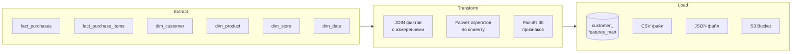
```mermaid
flowchart LR
    subgraph Extract["Extract"]
        E1[fact_purchases]
        E2[fact_purchase_items]
        E3[dim_customer]
        E4[dim_product]
        E5[dim_store]
        E6[dim_date]
    end
    
    subgraph Transform["Transform"]
        T1[JOIN фактов<br/>с измерениями]
        T2[Расчёт агрегатов<br/>по клиенту]
        T3[Расчёт 30<br/>признаков]
    end
    
    subgraph Load["Load"]
        L1[(customer_<br/>features_mart)]
        L2[CSV файл]
        L3[JSON файл]
        L4[S3 Bucket]
    end
    
    Extract --> Transform
    Transform --> Load
```

### 30 признаков клиентов

| № | Имя | Категория | Формула расчёта | Порог |
|---|-----|-----------|-----------------|-------|
| **Предпочтения по продуктам** | | | | |
| 1 | `bought_milk_last_30d` | product_preference | `SUM(CASE WHEN product_group LIKE '%молочные%' THEN 1 ELSE 0 END) > 0` | 30 дней |
| 2 | `bought_fruits_last_14d` | product_preference | `SUM(CASE WHEN product_group LIKE '%фрукты%' THEN 1 ELSE 0 END) > 0` | 14 дней |
| 3 | `not_bought_veggies_14d` | product_preference | `SUM(CASE WHEN product_group LIKE '%овощи%' THEN 1 ELSE 0 END) = 0` | 14 дней |
| 4 | `organic_preference` | product_preference | `SUM(CASE WHEN is_organic = 1 THEN 1 ELSE 0 END) > 0` | ≥1 |
| 5 | `buys_bakery` | product_preference | `SUM(CASE WHEN product_group LIKE '%хлеб%' THEN 1 ELSE 0 END) > 0` | ≥1 |
| 6 | `bought_meat_last_week` | product_preference | `SUM(CASE WHEN product_group LIKE '%мясо%' THEN 1 ELSE 0 END) > 0` | 7 дней |
| 7 | `fruit_lover` | product_preference | `COUNT(CASE WHEN product_group LIKE '%фрукты%' THEN 1 END) ≥ 3` | ≥3 покупки |
| 8 | `vegetarian_profile` | product_preference | `SUM(CASE WHEN product_group LIKE '%мясо%' THEN 1 ELSE 0 END) = 0` | 90 дней |
| **Покупательское поведение** | | | | |
| 9 | `recurrent_buyer` | purchase_behavior | `COUNT(purchase_id) > 2` | >2 покупки |
| 10 | `inactive_14_30` | purchase_behavior | `MAX(purchase_date) BETWEEN now-30d AND now-14d` | — |
| 11 | `delivery_user` | purchase_behavior | `SUM(CASE WHEN is_delivery = 1 THEN 1 ELSE 0 END) > 0` | ≥1 |
| 12 | `no_purchases` | purchase_behavior | `COUNT(purchase_id) = 0` | 0 покупок |
| **Лояльность** | | | | |
| 13 | `new_customer` | loyalty | `DATEDIFF(day, registration_date, now) < 30` | <30 дней |
| 14 | `loyal_customer` | loyalty | `is_loyalty_member = 1 AND COUNT(purchase_id) ≥ 3` | ≥3 покупки |
| **Платёжеспособность** | | | | |
| 15 | `bulk_buyer` | spending | `AVG(total_amount) > 1000` | >1000₽ |
| 16 | `low_cost_buyer` | spending | `AVG(total_amount) < 200` | <200₽ |
| 17 | `recent_high_spender` | spending | `SUM(total_amount) > 2000` | >2000₽ за 7 дней |
| **Временные паттерны** | | | | |
| 18 | `night_shopper` | temporal | `SUM(CASE WHEN hour(purchase_time) ≥ 20 THEN 1 ELSE 0 END) > 0` | ≥20:00 |
| 19 | `morning_shopper` | temporal | `SUM(CASE WHEN hour(purchase_time) < 10 THEN 1 ELSE 0 END) > 0` | <10:00 |
| 20 | `weekend_shopper` | temporal | `SUM(CASE WHEN day_of_week ≥ 6 THEN 1 ELSE 0 END) / COUNT(*) ≥ 0.6` | ≥60% |
| 21 | `weekday_shopper` | temporal | `SUM(CASE WHEN day_of_week < 6 THEN 1 ELSE 0 END) / COUNT(*) ≥ 0.6` | ≥60% |
| 22 | `early_bird` | temporal | `SUM(CASE WHEN hour BETWEEN 12 AND 15 THEN 1 ELSE 0 END) > 0` | 12-15 часов |
| **Способы оплаты** | | | | |
| 23 | `prefers_cash` | payment | `SUM(CASE WHEN payment_method = 'cash' THEN 1 ELSE 0 END) / COUNT(*) ≥ 0.7` | ≥70% |
| 24 | `prefers_card` | payment | `SUM(CASE WHEN payment_method = 'card' THEN 1 ELSE 0 END) / COUNT(*) ≥ 0.7` | ≥70% |
| **География** | | | | |
| 25 | `multicity_buyer` | location | `COUNT(DISTINCT city) > 1` | >1 город |
| 26 | `store_loyal` | location | `COUNT(DISTINCT store_id) = 1` | 1 магазин |
| 27 | `switching_store` | location | `COUNT(DISTINCT store_id) > 1` | >1 магазин |
| **Характеристики корзины** | | | | |
| 28 | `single_item_buyer` | basket | `SUM(CASE WHEN items_count = 1 THEN 1 ELSE 0 END) / COUNT(*) ≥ 0.5` | ≥50% |
| 29 | `varied_shopper` | basket | `COUNT(DISTINCT product_group) ≥ 4` | ≥4 категории |
| 30 | `family_shopper` | basket | `AVG(items_count) ≥ 4` | ≥4 позиции |


### Алгоритм ETL

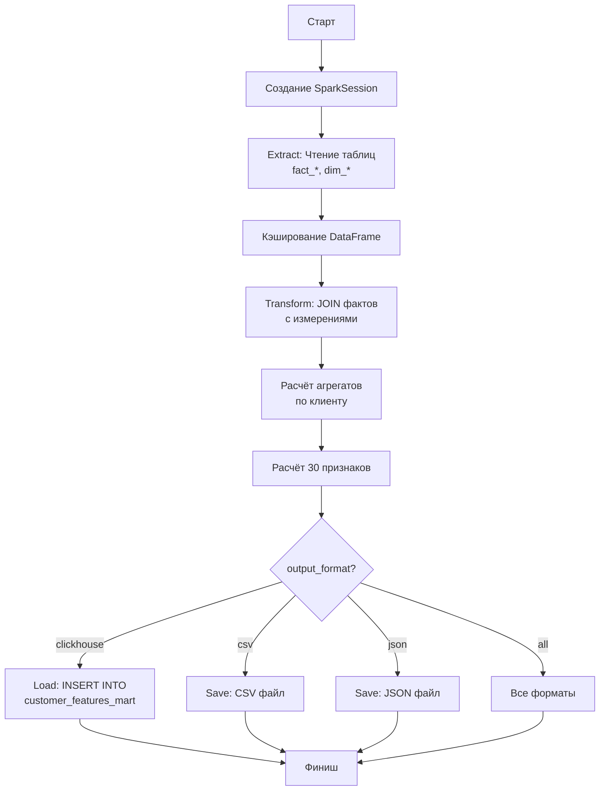
```mermaid
flowchart TD
    A[Старт] --> B[Создание SparkSession]
    B --> C[Extract: Чтение таблиц<br/>fact_*, dim_*]
    C --> D[Кэширование DataFrame]
    D --> E[Transform: JOIN фактов<br/>с измерениями]
    E --> F[Расчёт агрегатов<br/>по клиенту]
    F --> G[Расчёт 30 признаков]
    G --> H{output_format?}
    H -->|clickhouse| I[Load: INSERT INTO<br/>customer_features_mart]
    H -->|csv| J[Save: CSV файл]
    H -->|json| K[Save: JSON файл]
    H -->|all| L[Все форматы]
    I --> M[Финиш]
    J --> M
    K --> M
    L --> M
```

---

## Выгрузка в S3

### Модуль: `src/pikcha_etl/etl/upload_to_s3.py`

**Класс:** `S3Uploader`

**Ответственность:** Загрузка результатов ETL в S3-совместимое хранилище.

### Конфигурация S3

| Параметр | Значение | Описание |
|----------|----------|----------|
| **Endpoint** | `https://s3.ru-7.storage.selcloud.ru` | Selectel Cloud Storage |
| **Bucket** | `de-internship-pikcha` | Имя бакета |
| **Region** | `ru-7` | Регион (Москва) |
| **Форматы** | CSV, JSON | Выходные файлы |

### Структура бакета

```
s3://de-internship-pikcha/
├── analytic_result_2026_02_25.csv
├── analytic_result_2026_02_25.json
├── analytic_result_2026_02_26.csv
└── analytic_result_2026_02_26.json
```

### Алгоритм загрузки

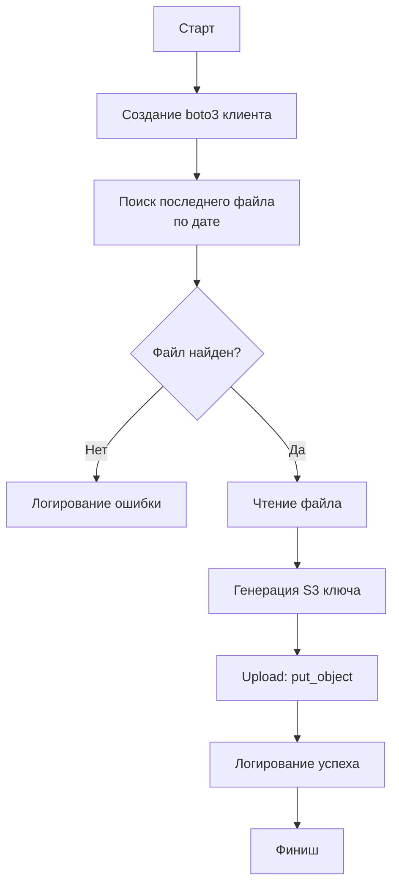
```mermaid
flowchart TD
    A[Старт] --> B[Создание boto3 клиента]
    B --> C[Поиск последнего файла<br/>по дате]
    C --> D{Файл найден?}
    D -->|Нет| E[Логирование ошибки]
    D -->|Да| F[Чтение файла]
    F --> G[Генерация S3 ключа]
    G --> H[Upload: put_object]
    H --> I[Логирование успеха]
    I --> J[Финиш]
```

---

## Grafana Dashboards: Архитектура системы мониторинга

### Архитектурный обзор

Система мониторинга на базе **Grafana** обеспечивает визуализацию данных ETL-пайплайна, контроль качества данных и алертинг в реальном времени.

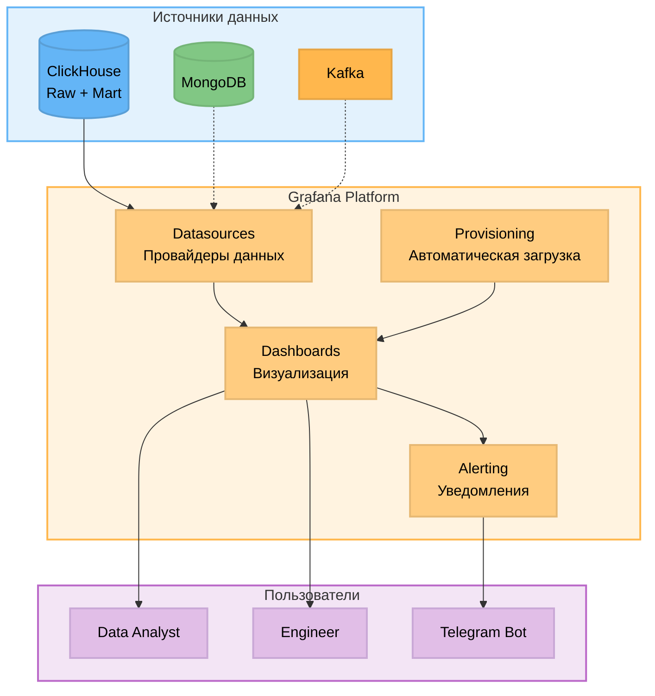
```mermaid
flowchart TB
    subgraph DataSources["Источники данных"]
        CH[(ClickHouse<br/>Raw + Mart)]
        MG[(MongoDB)]
        KF[Kafka]
    end

    subgraph Grafana["Grafana Platform"]
        DS[Datasources<br/>Провайдеры данных]
        PR[Provisioning<br/>Автоматическая загрузка]
        DB[Dashboards<br/>Визуализация]
        AL[Alerting<br/>Уведомления]
    end

    subgraph Users["Пользователи"]
        DA[Data Analyst]
        EN[Engineer]
        TG[Telegram Bot]
    end

    CH --> DS
    MG -.-> DS
    KF -.-> DS

    DS --> DB
    PR --> DB
    DB --> AL
    AL --> TG

    DB --> DA
    DB --> EN

    %% Цветовая схема подграфов - пастельные тона
    style DataSources fill:#e3f2fd,stroke:#64b5f6,stroke-width:2px
    style Grafana fill:#fff3e0,stroke:#ffb74d,stroke-width:2px
    style Users fill:#f3e5f5,stroke:#ba68c8,stroke-width:2px

    %% Цветовая схема компонентов - приглушённые пастельные тона
    style CH fill:#64b5f6,color:#000,stroke:#5a9fd6,stroke-width:2px
    style MG fill:#81c784,color:#000,stroke:#74b577,stroke-width:2px
    style KF fill:#ffb74d,color:#000,stroke:#e6a545,stroke-width:2px
    style DS fill:#ffcc80,color:#000,stroke:#e6b873,stroke-width:2px
    style PR fill:#ffcc80,color:#000,stroke:#e6b873,stroke-width:2px
    style DB fill:#ffcc80,color:#000,stroke:#e6b873,stroke-width:2px
    style AL fill:#ffcc80,color:#000,stroke:#e6b873,stroke-width:2px
    style DA fill:#e1bee7,color:#000,stroke:#c9a8d6,stroke-width:2px
    style EN fill:#e1bee7,color:#000,stroke:#c9a8d6,stroke-width:2px
    style TG fill:#e1bee7,color:#000,stroke:#c9a8d6,stroke-width:2px
```

---

### 📁 Структура компонентов Grafana

```
grafana/
├── provisioning/              # Автоматическая конфигурация
│   └── dashboards.yml         # Провайдер дашбордов
│
├── datasources/               # Источники данных
│   └── clickhouse.yml         # Подключение к ClickHouse
│
├── dashboards/                # JSON-файлы дашбордов
│   ├── raw_layer_stats.json           # Статистика RAW-слоя
│   ├── raw_duplicates_analysis.json   # Дубликаты RAW
│   ├── mart_layer_stats.json          # Статистика MART-слоя
│   ├── mart_duplicates_analysis.json  # Дубликаты MART
│   ├── customer_features_matrix.json  # Признаки клиентов
│   └── stores_geo_map.json            # Гео-карта магазинов
│
└── alerting/                  # Система алертинга
    ├── alert-rules.yml        # Правила срабатывания
    └── contact-points.yml     # Контактные точки (Telegram)
```

---

### 🔌 Источники данных (Datasources)

**Основной источник:** ClickHouse

| Параметр | Значение |
|----------|----------|
| **Тип** | `grafana-clickhouse-datasource` |
| **Хост** | `clickhouse:8123` (Docker) |
| **Протокол** | HTTP |
| **База по умолчанию** | `raw` |
| **Аутентификация** | `clickhouse` / `clickhouse` |

**Конфигурация:** `grafana/datasources/clickhouse.yml`

```yaml
apiVersion: 1
datasources:
  - name: ClickHouse
    type: grafana-clickhouse-datasource
    access: proxy
    url: http://clickhouse:8123
    isDefault: true
    editable: true
    jsonData:
      defaultDatabase: raw
      port: 8123
      server: clickhouse
      username: clickhouse
      tlsSkipVerify: false
      protocol: http
    secureJsonData:
      password: clickhouse
```

**Дополнительные источники (опционально):**
- MongoDB — для мониторинга операционных данных
- Kafka — для мониторинга топиков и лагов консюмеров

---

### 📂 Провижининг (Provisioning)

Автоматическая загрузка дашбордов при старте Grafana.

**Конфигурация:** `grafana/provisioning/dashboards.yml`

```yaml
apiVersion: 1
providers:
  - name: 'Raw Layer Dashboards'
    orgId: 1
    folder: 'ETL Monitoring'
    folderUid: 'etl-monitoring'
    type: file
    disableDeletion: false
    updateIntervalSeconds: 30
    allowUiUpdates: true
    options:
      path: /etc/grafana/provisioning/dashboards
      foldersFromFilesStructure: true
```

**Параметры:**
- `folder: 'ETL Monitoring'` — все дашборды группируются в папке
- `updateIntervalSeconds: 30` — проверка изменений каждые 30 секунд
- `allowUiUpdates: true` — разрешено редактирование через UI
- `disableDeletion: false` — можно удалять через UI

---

### 📈 Дашборды: Архитектура и назначение

#### 1. 📊 RAW Layer Statistics
**Файл:** `raw_layer_stats.json` | **UID:** `raw-layer-stats`

**Назначение:** Мониторинг сырых данных в ClickHouse (raw-слой).

**Панели:**
| Панель | Тип | SQL-запрос | Назначение |
|--------|-----|------------|------------|
| **📊 Total Records** | Stat | `SELECT sum(rows) FROM system.parts WHERE database = 'raw'` | Общее количество записей |
| **🏪/📦/👥/🛒** | Stat | `SELECT sum(rows) FROM system.parts WHERE table = '...'` | Записи по таблицам |
| **📊 Records per Table** | Pie Chart | `SELECT table, sum(rows) FROM system.parts GROUP BY table` | Распределение по таблицам |
| **📈 Records Over Time** | Time Series | `SELECT toStartOfHour(event_time), count() FROM raw.* GROUP BY time` | Динамика поступления |
| **📋 Table Details** | Table | `SELECT table, sum(rows), sum(data_compressed_bytes) FROM system.parts` | Детали: записи + размер |
| **⏰ Data Freshness** | Stat | `SELECT now() - max(event_time) FROM raw.stores` | Время с последней записи |
| **🕐 Last Update** | Stat | `SELECT max(event_time) FROM raw.stores` | Дата последнего обновления |

**Обновление:** каждые 30 секунд

---

#### 2. 📊 MART Layer Statistics
**Файл:** `mart_layer_stats.json` | **UID:** `mart-layer-stats`

**Назначение:** Мониторинг количества записей в таблицах MART-слоя.

**Панели:**

| Панель | Тип | SQL-запрос | Назначение |
|--------|-----|------------|------------|
| **📊 Total Records** | Stat | `SELECT sum(rows) FROM system.parts WHERE database = 'mart'` | Общее количество записей |
| **🏭 dim_manufacturer** | Stat | `SELECT sum(rows) FROM system.parts WHERE table = 'dim_manufacturer'` | Записи в справочнике производителей |
| **📍 dim_store_location** | Stat | `SELECT sum(rows) FROM system.parts WHERE table = 'dim_store_location'` | Записи в справочнике локаций |
| **🏠 dim_delivery_address** | Stat | `SELECT sum(rows) FROM system.parts WHERE table = 'dim_delivery_address'` | Записи в справочнике адресов |
| **📦 dim_product** | Stat | `SELECT sum(rows) FROM system.parts WHERE table = 'dim_product'` | Записи в справочнике продуктов |
| **👥 dim_customer** | Stat | `SELECT sum(rows) FROM system.parts WHERE table = 'dim_customer'` | Записи в справочнике клиентов |
| **🏪 dim_store** | Stat | `SELECT sum(rows) FROM system.parts WHERE table = 'dim_store'` | Записи в справочнике магазинов |
| **📅 dim_date** | Stat | `SELECT sum(rows) FROM system.parts WHERE table = 'dim_date'` | Записи в справочнике дат |
| **🛒 fact_purchases** | Stat | `SELECT sum(rows) FROM system.parts WHERE table = 'fact_purchases'` | Записи в факте покупок |
| **📋 fact_purchase_items** | Stat | `SELECT sum(rows) FROM system.parts WHERE table = 'fact_purchase_items'` | Записи в факте позиций |
| **🧬 customer_features_mart** | Stat | `SELECT sum(rows) FROM system.parts WHERE table = 'customer_features_mart'` | Записи в витрине признаков |

**Обновление:** каждые 30 секунд

---

#### 3. 🔄 RAW Layer Duplicates Analysis
**Файл:** `raw_duplicates_analysis.json` | **UID:** `raw-duplicates-analysis`

**Назначение:** Контроль качества данных RAW-слоя (поиск дубликатов).

**Панели:**
| Панель | Тип | SQL-запрос | Пороги |
|--------|-----|------------|--------|
| **🔄 Total Duplicate Records** | Stat | `SELECT (count() - count(DISTINCT key)) FROM raw.*` | — |
| **📊 Duplicates per Table** | Bar Chart | `SELECT 'table', count() FROM (SELECT key GROUP BY key HAVING count() > 1)` | — |
| **🏪/📦/👥/🛒 duplicates %** | Gauge | `SELECT round((count() - count(DISTINCT key)) * 100.0 / count(), 2)` | 🟢 0% / 🔴 ≥49% |

**Связанные алерты:** 4 правила (по одному на таблицу)

---

#### 4. 🔄 MART Layer Duplicates Analysis
**Файл:** `mart_duplicates_analysis.json` | **UID:** `mart-duplicates-analysis`

**Назначение:** Контроль качества данных MART-слоя (поиск дубликатов).

**Панели:**
| Панель | Тип | Таблицы | Пороги |
|--------|-----|---------|--------|
| **🔄 Total Duplicate Records** | Stat | Все таблицы mart | — |
| **🏭/📍/🏠/📦/👥/🏪/📅 %** | Gauge | `dim_*` | 🟢 0% / 🟡 ≥10% / 🔴 ≥49% |
| **🛒/📋 %** | Gauge | `fact_*` | 🟢 0% / 🟡 ≥10% / 🔴 ≥49% |
| **📈 Duplicate Statistics** | Table | Все | Детали по таблицам |

---

#### 5. 🧬 Customer Features Matrix
**Файл:** `customer_features_matrix.json` | **UID:** `customer-features-matrix`

**Назначение:** Визуализация 30 бинарных признаков клиентов для ML-кластеризации.

**Панели:**
| Панель | Тип | Описание |
|--------|-----|----------|
| **👥 Total Customers** | Stat | Количество клиентов в витрине |
| **🛒 Avg Purchases** | Stat | Среднее количество покупок |
| **💰 Avg Total Spent** | Stat | Средняя сумма затрат (₽) |
| **🛍️ Avg Cart Amount** | Stat | Средний размер корзины (₽) |
| **💎 Loyal Customers** | Stat | Доля лояльных клиентов |
| **📊 Customer Features Matrix** | Heatmap Table | Матрица 30 признаков (топ-100 по тратам) |

**Признаки в матрице:**
- **product_preference** (8): `bought_milk_last_30d`, `bought_fruits_last_14d`, ...
- **purchase_behavior** (4): `recurrent_buyer`, `inactive_14_30`, ...
- **loyalty** (2): `new_customer`, `loyal_customer`
- **spending** (3): `bulk_buyer`, `low_cost_buyer`, ...
- **temporal** (5): `night_shopper`, `morning_shopper`, ...
- **payment** (2): `prefers_cash`, `prefers_card`
- **location** (3): `multicity_buyer`, `store_loyal`, ...
- **basket** (3): `single_item_buyer`, `varied_shopper`, ...

---

#### 6. 🗺️ Stores Geography Map
**Файл:** `stores_geo_map.json` | **UID:** `stores-geo-map`

**Назначение:** Географическая визуализация расположения магазинов.

**Панели:**
| Панель | Тип | Данные |
|--------|-----|--------|
| **🗺️ Stores Map** | Geomap | `SELECT store_id, store_name, latitude, longitude, store_network FROM raw.stores` |
| **🏪 Total Stores** | Stat | `SELECT count(DISTINCT store_id)` |
| **🏙️ Cities** | Stat | `SELECT count(DISTINCT location_city)` |
| **🔗 Networks** | Stat | `SELECT count(DISTINCT store_network)` |
| **🌐 Online Orders** | Stat | `SELECT count() WHERE accepts_online_orders = 'True'` |
| **🚚 Delivery** | Stat | `SELECT count() WHERE delivery_available = 'True'` |
| **🔗 Stores by Network** | Pie Chart | `SELECT store_network, count() GROUP BY store_network` |
| **🏙️ Stores by City** | Table | `SELECT city, count() GROUP BY city ORDER BY count DESC` |

---

### 🔔 Система алертинга

#### Архитектура алертинга

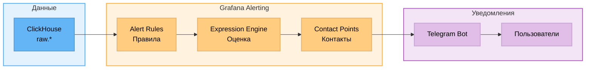
```mermaid
flowchart LR
    subgraph Grafana["Grafana Alerting"]
        AR[Alert Rules<br/>Правила]
        EX[Expression Engine<br/>Оценка]
        CP[Contact Points<br/>Контакты]
    end

    subgraph Data["Данные"]
        CH[ClickHouse<br/>raw.*]
    end

    subgraph Notify["Уведомления"]
        TG[Telegram Bot]
        US[Пользователи]
    end

    CH --> AR
    AR --> EX
    EX --> CP
    CP --> TG
    TG --> US

    %% Цветовая схема подграфов - пастельные тона
    style Grafana fill:#fff3e0,stroke:#ffb74d,stroke-width:2px
    style Data fill:#e3f2fd,stroke:#64b5f6,stroke-width:2px
    style Notify fill:#f3e5f5,stroke:#ba68c8,stroke-width:2px

    %% Цветовая схема компонентов - приглушённые пастельные тона
    style AR fill:#ffcc80,color:#000,stroke:#e6b873,stroke-width:2px
    style EX fill:#ffcc80,color:#000,stroke:#e6b873,stroke-width:2px
    style CP fill:#ffcc80,color:#000,stroke:#e6b873,stroke-width:2px
    style CH fill:#64b5f6,color:#000,stroke:#5a9fd6,stroke-width:2px
    style TG fill:#e1bee7,color:#000,stroke:#c9a8d6,stroke-width:2px
    style US fill:#e1bee7,color:#000,stroke:#c9a8d6,stroke-width:2px
```

#### Правила алертов (alert-rules.yml)

**Группа:** `Duplicates Alert Rules`

| Алерт | UID | Условие | Порог | Приоритет |
|-------|-----|---------|-------|-----------|
| **🏪 Stores Duplicates** | `stores-duplicates-alert` | `(count() - count(DISTINCT store_id)) * 100 / count()` | > 49% | 🔴 Critical |
| **📦 Products Duplicates** | `products-duplicates-alert` | `(count() - count(DISTINCT id)) * 100 / count()` | > 49% | 🔴 Critical |
| **👥 Customers Duplicates** | `customers-duplicates-alert` | `(count() - count(DISTINCT customer_id)) * 100 / count()` | > 49% | 🔴 Critical |
| **🛒 Purchases Duplicates** | `purchases-duplicates-alert` | `(count() - count(DISTINCT purchase_id)) * 100 / count()` | > 49% | 🔴 Critical |

**Структура правила (на примере Stores):**

```yaml
- uid: stores-duplicates-alert
  title: 🏪 Stores Duplicates > 50%
  condition: C  # C > 49% → алерт
  data:
    - refId: A  # SQL-запрос к ClickHouse
      queryType: table
      rawSql: SELECT round((count() - count(DISTINCT store_id)) * 100.0 / count(), 2) FROM raw.stores;
    - refId: B  # Reduce: последнее значение
      type: reduce
      expression: A
      reducer: last
    - refId: C  # Threshold: порог 49%
      type: threshold
      expression: B
  for: 0s  # Срабатывание немедленно
  noDataState: NoData
  execErrState: Error
  annotations:
    summary: "🚨 [CRITICAL] Дубликаты в таблице 🏪 stores превысили 50%!"
  labels:
    severity: critical
    table: stores
```

---

#### Контактные точки (contact-points.yml)

**Получатель:** `Telegram Duplicates Alert`

```yaml
contactPoints:
  - orgId: 1
    name: Telegram Duplicates Alert
    receivers:
      - uid: telegram-duplicates-receiver
        type: telegram
        settings:
          botToken: <BOT_TOKEN>
          chatId: "<CHAT_ID>"
          message: |
            🤖 >_ SYSTEM ALERT v.2077
            🚨 [!] DUPLICATE DETECTION
            🎯 TARGET: [{{ .Labels.table }}]
            🔴 DUPLICATE RATE: {{ .Annotations.description }}
            🔗 ACCESS: http://localhost:3000/d/...
```

**Политики уведомлений:**

| Параметр | Значение |
|----------|----------|
| **group_by** | `['alertname']` |
| **group_wait** | `5s` (ожидание группы) |
| **group_interval** | `10s` (интервал между группами) |
| **repeat_interval** | `10m` (повтор каждые 10 минут) |

---

### 📊 Поток данных мониторинга

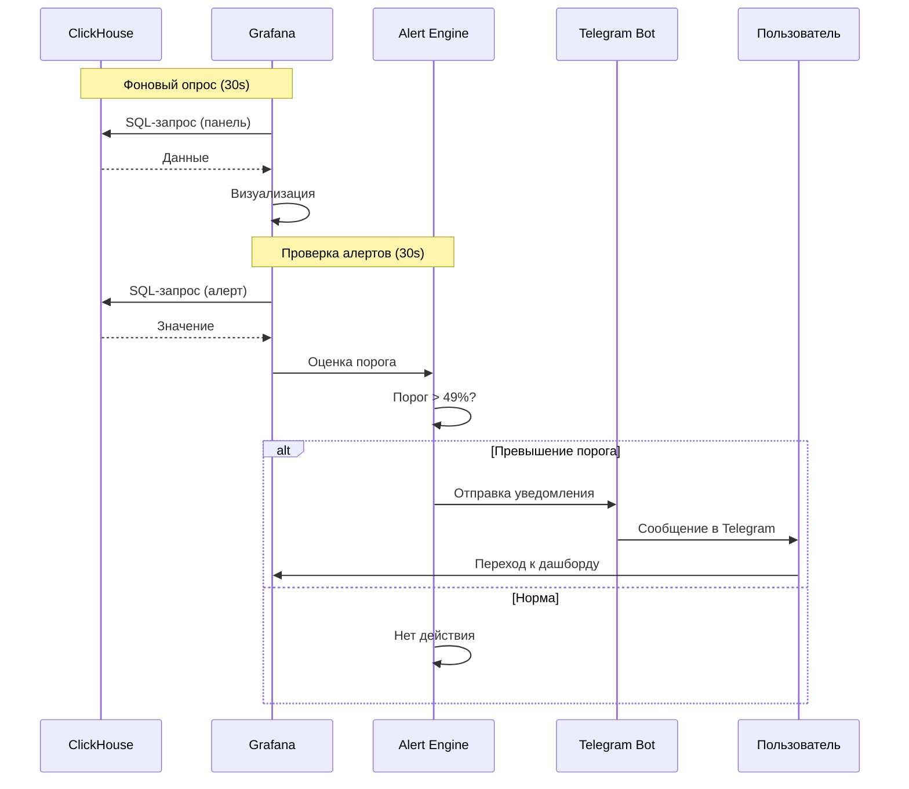
```mermaid
sequenceDiagram
    participant CH as ClickHouse
    participant GF as Grafana
    participant AL as Alert Engine
    participant TG as Telegram Bot
    participant US as Пользователь

    Note over CH,GF: Фоновый опрос (30s)
    GF->>CH: SQL-запрос (панель)
    CH-->>GF: Данные
    GF->>GF: Визуализация

    Note over GF,AL: Проверка алертов (30s)
    GF->>CH: SQL-запрос (алерт)
    CH-->>GF: Значение
    GF->>AL: Оценка порога
    AL->>AL: Порог > 49%?
    
    alt Превышение порога
        AL->>TG: Отправка уведомления
        TG->>US: Сообщение в Telegram
        US->>GF: Переход к дашборду
    else Норма
        AL->>AL: Нет действия
    end
```

---

### 🔧 Интеграция с ETL-пайплайном

Grafana взаимодействует со всеми слоями ETL:

| Слой ETL | Данные для мониторинга | Дашборд |
|----------|----------------------|---------|
| **Raw** | Количество записей, дубликаты, свежесть | RAW Layer Statistics, RAW Duplicates |
| **Mart** | Количество записей, дубликаты, метрики | MART Layer Statistics, MART Duplicates |
| **Features** | Признаки клиентов, метрики | Customer Features Matrix |
| **Stores** | Гео-локации, сети, города | Stores Geo Map |

---

### 📁 Конфигурационные файлы

| Файл | Назначение | Путь |
|------|------------|------|
| `dashboards.yml` | Провижининг дашбордов | `grafana/provisioning/` |
| `clickhouse.yml` | Источник данных | `grafana/datasources/` |
| `alert-rules.yml` | Правила алертов | `grafana/alerting/` |
| `contact-points.yml` | Контактные точки | `grafana/alerting/` |
| `*.json` (6 файлов) | Дашборды | `grafana/dashboards/` |

---

### 🚀 Доступ к Grafana

| Параметр | Значение |
|----------|----------|
| **URL** | `http://localhost:3000` |
| **Логин** | `admin` |
| **Пароль** | `admin` (из `.env`) |
| **Папка дашбордов** | `ETL Monitoring` |
| **Папка алертов** | `Alerts` |

---

## Логирование

### Конфигурация

**Модуль:** `config/logging.py`

**Формат сообщений:**
```
%(asctime)s - %(name)s - %(levelname)s - %(message)s
```


### Структура `logs/`

```
logs/
├── init_clickhouse.log          # Инициализация ClickHouse
├── generate_data.log            # Генератор данных
├── load_to_mongo.log            # Загрузчик MongoDB
├── run_producer.log             # Kafka Producer
├── run_consumer.log             # Kafka Consumer
├── run_etl.log                  # ETL процесс (Spark)
├── cleanup_all.log              # Полная очистка данных
├── dedup_mart.log               # Дедупликация таблиц mart-слоя
│
├── dag_id=00_run_sql_scripts/   # DAG: SQL Scripts
├── dag_id=01_generate_synthetic_data/  # DAG: Generate Data
├── dag_id=02_load_data_to_mongodb/     # DAG: Load to MongoDB
├── dag_id=03_run_mongodb_kafka_producer/  # DAG: Producer
├── dag_id=04_run_kafka_clickhouse_consumer/  # DAG: Consumer
├── dag_id=05_run_customer_feature_etl/  # DAG: ETL
├── dag_id=etl_pipeline/         # DAG: ETL Pipeline
│
├── scheduler/                   # Внутренние логи планировщика
└── dag_processor_manager/       # Управление обработкой DAG-файлов
```

### Уровни логирования

| Уровень | Когда используется |
|---------|-------------------|
| `INFO` | Старт/финиш этапов, количество обработанных записей |
| `WARNING` | Некритичные проблемы (отсутствуют данные) |
| `ERROR` | Ошибки подключения, исключения |
| `DEBUG` | Детальная отладка (отключено по умолчанию) |

### Просмотр логов Airflow

```bash
# Логи веб-сервера
docker-compose logs -f airflow-webserver

# Логи планировщика
docker-compose logs -f airflow-scheduler

# Логи воркера
docker-compose logs -f airflow-worker

# Все логи Airflow
docker-compose logs -f airflow
```

---
